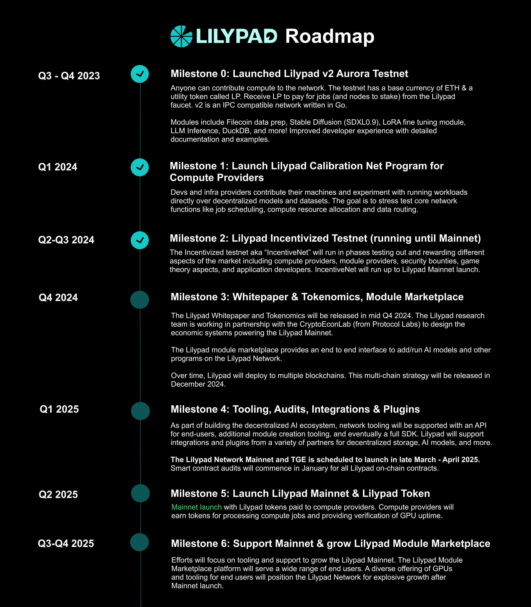

# 🍃 Lilypad Home

[Lilypad](https://lilypad.tech)  is developing a serverless, distributed compute network that enables internet-scale data processing, AI, ML & other arbitrary computation, while unleashing idle processing power & unlocking a new marketplace for compute.&#x20;

You can use Lilypad to run AI workload models including Stable Diffusion and Stable Diffusion Video, or you can add your own module to run on the Lilypad Network. Using Lilypads distributed compute nodes, you can build and run your own containerized workloads that require high-performance computing.&#x20;



## Overview

[Lilypad](https://lilypad.tech) provides distributed computational services underpinned by the [Bacalhau Project](https://www.bacalhau.org/). The network provides infrastructure for use cases like AI inference, ML training, DeSci and more. Lilypad strategically collaborates with decentralized infrastructure networks, such as Filecoin, to formulate a transparent, efficient, and accessible computational ecosystem.&#x20;

Perform off-chain decentralized compute over data, with on-chain guarantees. Call this functionality directly from a smart contract, CLI, and an easy to use abstraction layer.


In the video above, Ally Haire, Co-Founder of Lilypad, provides an introduction to the project and its goals.


The network is actively laying groundwork for multi-chain integration and the deployment of an incentivized testnet.

Lilypad has evolved from earlier versions (v0, v1 & v2), where the network served as a proof of concept for verifiable, decentralized compute directly from smart contracts. These earlier iterations established the groundwork for what is now a robust, scalable platform with expanded features and multichain support.

Bacalhau has been integral to Lilypad since its early versions (v0 and v1), serving as the backbone for verifiable off-chain compute. In these early iterations, Bacalhau was used for Proof of Concept projects, helping users execute decentralized compute jobs from smart contracts.

Find Lilypad on [GitHub](https://github.com/Lilypad-Tech/lilypad) or visit [the blog](https://blog.lilypadnetwork.org/).&#x20;

### Objective and problem statement

Lilypad aims to mitigate the challenges predominantly associated with the accessibility of high-performance computational hardware. At present, numerous barriers impede developers and organizations from smoothly integrating projects that require high-performance computing, such as AI technologies, into their applications.&#x20;

Unlike conventional centralized systems, where access to powerful compute hardware is restricted and costly, Lilypad endeavors to democratize this access. Through its verifiable, trustless, and decentralized computational network, Lilypad extends unrestricted, global access to computational power. By leveraging decentralized infrastructure networks such as Filecoin, Lilypad is strategically positioned to enhance the efficiency, transparency, and accessibility of high-performance computing hardware.

### Applications

Perform off-chain decentralized compute over data, with on-chain guarantees, and to call this functionality directly from a smart contract, CLI, API and an easy to use abstraction layer, opens the door to a multitude of possible applications including:

* Inference AI jobs
* ML training jobs
* Invoking & supporting generic ZK computations
* Cross-chain interoperability complement to bridge protocols
* Utilising inbuilt storage on IPFS
* Federated Learning consensus (with Bacalhau insulated jobs)
* IOT & Sensor Data integrations
* Providing a platform for Digital twins
* Supply chain tracking & analysis
* ETL & data preparation jobs

### Key features

Some of the key features of Lilypad include:

1. **Verifiable Serverless Decentralized Compute Network**: Lilypad is a decentralized compute network that aims to provide global, permissionless access to compute power. The Network orchestrates off-chain compute (a global GPU marketplace) and uses on-chain verification (Arbitrum L2 on Ethereum) to provide guarantees of compute success.
2. **Mainstream Web3 Application Support**: Lilypad is designed to enable mainstream web3 applications to use its compute network with the [Lilypad CLI](https://docs.lilypad.tech/lilypad/lilypad-testnet/install-run-requirements) and [Smart Contracts](https://docs.lilypad.tech/lilypad/developer-resources/lilypad-smart-contracts). It aims to make decentralized AI compute more accessible, efficient, and transparent for developers and users.
3. **Open Compute Network**: Lilypad is an open compute network allowing users to access and run AI models/other programs in a serverless manner. Module creators and general users can access a curated set of modules or can easily create their own Lilypad module to run an AI model/other program on the network.
4. **Multichain Support**: The Lilypad Incentivized Testnet [first launched](https://blog.lilypadnetwork.org/lilypad-project-report-june-19-2024#heading-engineering-update) on Arbitrum in June 2024 with plans to go multi-chain in the near future. Supporting multiple blockchain networks will increase the scalability and interoperability of the network, allowing users to choose the blockchain that best suits their needs.
5. **Incentivized Test Net**: The [Lilypad IncentiveNet](https://lilypadnetwork.notion.site/Leap-into-Lilypad-s-IncentiveNet-9e9b12936d4340ad9417d92dab8bd9d1) is live! The IncentiveNet program provide users with[ Lilybit\_ rewards ](https://blog.lilypadnetwork.org/incentivenet-lilybit-reward-calculations)to participate in running nodes, testing, and improving the network. Learn more by checking out the [IncentiveNet Leaderboard](https://info.lilypad.tech/leaderboard).&#x20;
6. **Decentralization of Mediators**: The team also aims to decentralize the mediators in the network. This means that the decision-making process and governance of the network will be distributed among multiple participants, ensuring a more decentralized and resilient system.

## What is the Bacalhau Project?

Bacalhau is a peer to peer computation network enabling compute over data jobs like GPU-enabled AI, ML, analytics, data engineering, data science, de-sci and more.\
\
With the open-source Bacalhau Project, you can streamline your existing workflows without rewriting by running Docker containers and WebAssembly (WASM) images as tasks. This architecture is also referred to as **Compute Over Data** (or CoD).

To find out more about it, see the Bacalhau [Docs](https://docs.bacalhau.org/)!

## Roadmap

<figure><figcaption></figcaption></figure>

## Lilypad Linktree - Learn more and join the community!

<figure><figcaption></figcaption></figure>

## Resources

* [FAQs](https://docs.lilypad.tech/lilypad/faqs)
* [Resource Provider (node) Leaderboard](https://info.lilypad.tech/leaderboard) - Lilybit\_ rewards
* [Lilypad Grafara RP dashboard](https://grafana.lilypad.tech/d/adxhou3o1q8sga/rewards-per-wallets?orgId=1\&refresh=1m) - Lilybit\_ rewards&#x20;
* [awesome-Lilypad](https://github.com/Lilypad-Tech/awesome-Lilypad/blob/main/README.md) repo with examples and use cases
* [Quick Start ](lilypad-testnet/quick-start/)- Run a Lilypad "Hello World"
* [Add](developer-resources/build-a-job-module.md) an AI model to Lilypad
* [Hardware requirements](hardware-providers/hardware-requirements.md) to run a Lilypad node
* [Run](hardware-providers/run-a-node/linux.md) a Lilypad node
* [Build](developer-resources/running-lilypad-in-a-front-end.md) a frontend using Lilypad to run AI Inference
* [Stable Diffusion Video](lilypad-modules/stable-diffusion-video-sdv1.0-and-1.1.md) - Text to video on Lilypad
* [Lilypad Discord server](https://lilypad.team/discord)
* [Previous Lilypad versions](https://docs.lilypad.tech/lilypad/resources/older-versions)

## Join the Community & Chat with Us

<table data-column-title-hidden data-view="cards"><thead><tr><th></th><th data-hidden></th><th data-hidden></th><th data-hidden data-card-target data-type="content-ref"></th><th data-hidden data-card-cover data-type="files"></th></tr></thead><tbody><tr><td>Lilypad Network</td><td></td><td></td><td><a href="https://lilypad.team/discord">https://lilypad.team/discord</a></td><td><a href=".gitbook/assets/image-29.webp">image-29.webp</a></td></tr><tr><td>Lilypad Linktree</td><td></td><td></td><td><a href="https://linktr.ee/LilypadNetwork">https://linktr.ee/LilypadNetwork</a></td><td><a href=".gitbook/assets/Screenshot 2024-05-17 at 11.12.32 AM.png">Screenshot 2024-05-17 at 11.12.32 AM.png</a></td></tr><tr><td>@Lilypad_Tech</td><td></td><td></td><td><a href="https://twitter.com/Lilypad_Tech">https://twitter.com/Lilypad_Tech</a></td><td><a href=".gitbook/assets/twitter.jpeg">twitter.jpeg</a></td></tr><tr><td>Lilypad Blog</td><td></td><td></td><td><a href="https://blog.lilypadnetwork.org/">https://blog.lilypadnetwork.org/</a></td><td><a href=".gitbook/assets/Screenshot 2024-05-17 at 11.14.42 AM.png">Screenshot 2024-05-17 at 11.14.42 AM.png</a></td></tr><tr><td>@LilypadNetwork</td><td></td><td></td><td><a href="https://www.youtube.com/@lilypadnetwork">https://www.youtube.com/@lilypadnetwork</a></td><td><a href=".gitbook/assets/8gzcr6RpGStvZFA2qRt4v6.jpg">8gzcr6RpGStvZFA2qRt4v6.jpg</a></td></tr><tr><td>Lilypad-Tech Github</td><td></td><td></td><td><a href="https://github.com/Lilypad-Tech">https://github.com/Lilypad-Tech</a></td><td><a href=".gitbook/assets/Screenshot 2024-05-17 at 11.13.11 AM.png">Screenshot 2024-05-17 at 11.13.11 AM.png</a></td></tr><tr><td>Lilypad Luma</td><td></td><td></td><td><a href="https://lu.ma/lilypadnetwork">https://lu.ma/lilypadnetwork</a></td><td><a href=".gitbook/assets/luma.webp">luma.webp</a></td></tr></tbody></table>




Filecoin Unleashed \[July '23] - Lilypad v1 Unlocks internet-scale web3 applications

