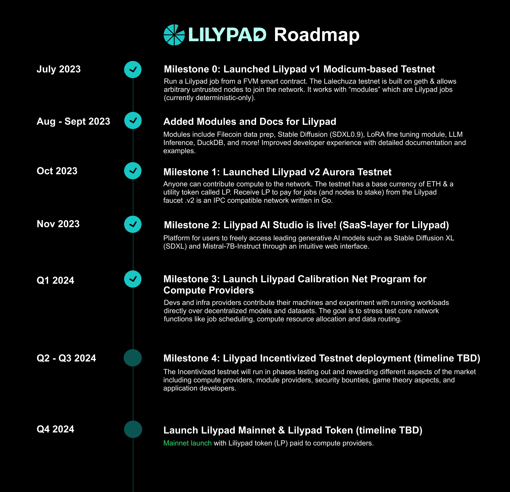

# ⚡ FAQs

## 🍃 General Questions

### What is the Lilypad Network?

Lilypad is developing a serverless, distributed compute network that enables internet-scale data processing for AI, ML & other arbitrary computation from blockchains, while unleashing idle processing power & unlocking a new marketplace for compute.

Lilypad provides decentralized AI computational services. By extending unrestricted, global access to computational power, Lilypad strategically collaborates with decentralized infrastructure networks, such as Filecoin, to formulate a transparent, efficient, and accessible computational ecosystem. Perform off-chain decentralized compute over data, with on-chain guarantees, and to call this functionality directly from a smart contract, CLI and an easy to use abstraction layer, opens the door to a multitude of possible applications.

### Lilypad Litepaper

Lilypad released a [Litepaper](https://docs.lilypad.tech/lilypad/research-and-vision/whitepaper) and will release a Whitepaper soon!

### Roadmap

Lilypad Network is currently on v3 of Testnet (Milky Way). The team is currently ironing out some remaining known issues and working on a fair model for our Incentivized Testnet.

Find the full Lilypad Network [roadmap](https://lilypad.tech/roadmap.html) on our website!

<figure><figcaption></figcaption></figure>

### Has Lilypad raised VC money?

Yes, Lilypad closed our seed round of funding in March 2024.

## 👩‍💻 Developer Questions

### What is a Lilypad Module?

To run a ML model like Stable Diffusion on Lilypad, the model must be setup as a Lilypad Module (see instructions below). Once setup, modules are run with the Lilypad [CLI](https://docs.lilypad.tech/lilypad/lilypad-milky-way-testnet/install-run-requirements) or [API](https://docs.lilypad.tech/lilypad/lilypad-milky-way-reference/javascript-cli-wrapper).

### How to run a ML job on Lilypad

To run a ML job on Lilypad (Stable Diffusion, Mistral 7b, Stable Diffusion Video, and more) using the Lilypad CLI, follow the [CLI instructions](https://docs.lilypad.tech/lilypad/lilypad-milky-way-testnet/install-run-requirements) to get started.&#x20;

To build an application with Lilypad compute and modules on the backend, check out this [guide](https://blog.lilypadnetwork.org/setting-up-your-lilypad-front-end).

### How to add a ML model to run on Lilypad

A Lilypad module is a Git repository that can be used to perform various tasks using predefined templates and inputs. This ["build a job module" guide](https://docs.lilypad.tech/lilypad/lilypad-milky-way-reference/build-a-job-module) will walk you through the process of creating a Lilypad module, including defining a JSON template, handling inputs, ensuring determinism, and other best practices.

### How to run a Lilypad node

Lilypad is an open network that allows anyone to contribute GPU computing capacity. There is currently no cost or incentives for running a Lilypad node. Find [instructions](https://docs.lilypad.tech/lilypad/lilypad-milky-way-reference/run-a-node) for running a node in the docs.

### Node hardware specs

* Linux (latest Ubuntu LTS recommended)
* Nvidia GPU
* Nvidia drivers
* Docker
* Nvidia docker drivers

For more information on the requirements to run a Lilypad node, please refer to the [hardware requirements](lilypad-hardware-provider/hardware-requirements.md) documentation.

## 🌐 Incentivized Testnet Questions

### When will the Incentivized Testnet launch?

The Lilypad Incentivized testnet is on track to launch in early June 2024. Stay tuned on [the Lilypad Discord](https://lilypad.team/discord) for more info!

## 📖 Token Questions

### Lilypad Tokenomics

Currently, there's no cost to run jobs and no incentive. Tokenomics and research papers are currently being developed and expected by early Q3 2024.&#x20;

### Expected TGE

Although the launch date is not finalized, the launch of Lilypad Mainnet and the TGE for LP tokens is scheduled for Q4 2024.

Can't find the answer you were looking for? Join [the Lilypad Discord server](https://lilypad.team/discord) for live support! 🪷
