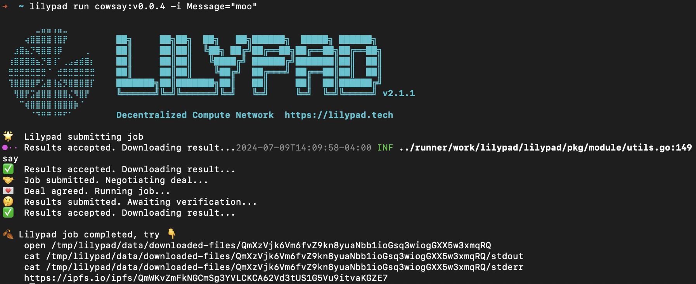
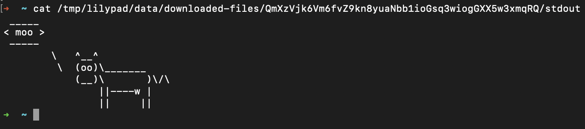

# Run Hello World!

Before you run a Lilypad job, make sure you have [Lilypad CLI installed](install-run-requirements.md) and have set [a `WEB3_PRIVATE_KEY` env variable](https://docs.lilypad.tech/lilypad/lilypad-testnet/install-run-requirements#set-web3_private_key) in your environment.


Your [`WEB3_PRIVATE_KEY`](https://docs.lilypad.tech/lilypad/lilypad-testnet/install-run-requirements#set-web3_private_key) can be retrieved from the MetaMask account details menu.  For more info, check out the [official guide from MetaMask](https://support.metamask.io/managing-my-wallet/secret-recovery-phrase-and-private-keys/how-to-export-an-accounts-private-key/) on how to get a your private key. **Be sure to keep your private key safe** and never share it or store it in unsecured places to prevent unauthorized access to your funds.


## Run Cowsay

Run the command:

```bash
lilypad run cowsay:v0.0.4 -i Message="moo"
```

Wait for the compute to take place and for the results to be published:

<figure><figcaption></figcaption></figure>

View your results:&#x20;

```bash
cat /tmp/lilypad/data/downloaded-files/QmXzVjk6Vm6fvZ9kn8yuaNbb1ioGsq3wiogGXX5w3xmqRQ/stdout
```

<figure><figcaption></figcaption></figure>
