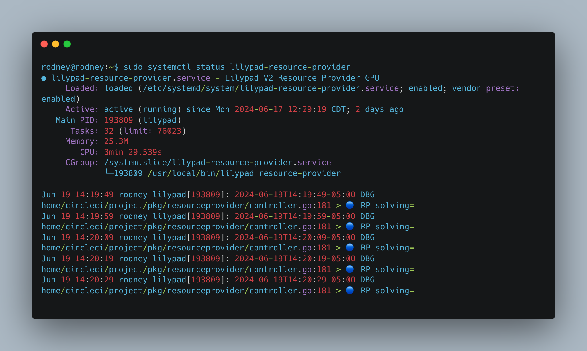

# Linux

## Prerequisites


For a more in-depth look at the requirements to run a Lilypad node, please refer to the [hardware requirements](../hardware-requirements.md) documentation.


* Linux (_Ubuntu 22.04_ LTS)
* Nvidia GPU
* [Nvidia drivers](https://ubuntu.com/server/docs/nvidia-drivers-installation)
* [Docker](https://docs.docker.com/engine/install/ubuntu/) (Ubuntu install)
* Nvidia Docker drivers


Lilypad RPs currently only support Linux installs. Running a RP on Windows is currently experimental. The resource provider version of Lilypad is not supported on Darwin/macOS.


## Network information and testnet tokens

The testnet has a base currency of ETH, as well as a utility token called LP. Both are used for running nodes. To add a node to the testnet, follow these steps:

### Metamask

We recommend using MetaMask with custom settings to make things easier. Once you have it installed and setup, here are the settings you need to use:


Network name: Arbitrum Sepolia

New RPC URL: [https://sepolia-rollup.arbitrum.io/rpc](https://sepolia-rollup.arbitrum.io/rpc)

Chain ID: 421614

Currency symbol: ETH

Block explorer URL: (leave blank)


For a step by step guide on adding the network and importing the LP testnet token, please refer to our [Setting up MetaMask documentation](../../lilypad-testnet/quick-start/setting-up-metamask.md).

### Fund your wallet with ETH and LP

To obtain testnet LP, use the [Lilypad faucet](http://faucet.lilypad.tech) and enter your ETH address.

To obtain testnet ETH, use a third party [Arbitrum Sepolia testnet faucet](https://arbitrum.faucet.dev/ArbSepolia) and enter your ETH address.


The Arbitrum Sepolia faucet provides 0.0001 tokens per request. If you need more tokens and already have Sepolia ETH, you can use the [official Arbitrum bridge](https://bridge.arbitrum.io/) to transfer it over to Arbitrum Sepolia.


The faucet will give you both ETH (to pay for gas) and LP (to stake and pay for jobs).

## Installation

To set up your environment for using Lilypad with GPU support, you need to install several key components. This guide will walk you through installing Docker, the Nvidia Container Toolkit, Bacalhau, and Lilypad. You'll also configure systemd to manage these services efficiently.

### Install Docker

Docker is a platform that allows you to automate the deployment of applications inside lightweight, portable containers.

To install Docker Engine, follow the steps specific to your operating system from the official Docker documentation:

* [Linux](https://docs.docker.com/engine/install/ubuntu/) - Docker Engine

### Install Nvidia Container Toolkit

To ensure proper operation of your graphics cards and Lilypad, follow these steps to install the Nvidia Toolkit Base Installer: [Nvidia Container Toolkit download page](https://docs.nvidia.com/datacenter/cloud-native/container-toolkit/latest/install-guide.html)

```bash
curl -fsSL https://nvidia.github.io/libnvidia-container/gpgkey | sudo gpg --dearmor -o /usr/share/keyrings/nvidia-container-toolkit-keyring.gpg \
  && curl -s -L https://nvidia.github.io/libnvidia-container/stable/deb/nvidia-container-toolkit.list | \
    sed 's#deb https://#deb [signed-by=/usr/share/keyrings/nvidia-container-toolkit-keyring.gpg] https://#g' | \
    sudo tee /etc/apt/sources.list.d/nvidia-container-toolkit.list
    
sudo apt-get update

sudo apt-get install -y nvidia-container-toolkit
```

Configure the container runtime by using the `nvidia-ctk` command:

```bash
 sudo nvidia-ctk runtime configure --runtime=docker --set-as-default
```

The `nvidia-ctk` command modifies the `/etc/docker/daemon.json` file on the host. The file is updated so that Docker can use the NVIDIA Container Runtime.

Restart the Docker daemon:

```bash
sudo systemctl restart docker
```

### Install ipfs

Run a local ipfs node on the Lilypad RP.


If permissions errors are encountered when trying to run `ipfs init`, ensure the ipfs node is not setup in the root user and is accessible by Bacalhau.


```bash
# Download the latest version of Kubo (go-ipfs):
wget https://dist.ipfs.tech/kubo/v0.30.0/kubo_v0.30.0_linux-amd64.tar.gz
# Extract the archive:
tar -xvzf kubo_v0.30.0_linux-amd64.tar.gz
# Change to the Kubo directory:
cd kubo
# Run the installation script:
sudo bash install.sh
# Now remove the downloaded archive file:
cd ..
rm kubo_v0.30.0_linux-amd64.tar.gz
# Create a new ipfs directory
sudo mkdir -p /app/data/ipfs
# Set IPFS_PATH environment variable
echo 'export IPFS_PATH=/app/data/ipfs' >> ~/.bashrc && source ~/.bashrc
# Change ownership of the ipfs directory to your user
sudo chown -R $USER:$USER /app/data/ipfs
# Initialize ipfs node
ipfs init 
# Start the ipfs node
ipfs daemon
```

### Install Bacalhau

Bacalhau is a peer-to-peer network of nodes that enables decentralized communication between computers. The network consists of two types of nodes, which can communicate with each other.


Bacalhau versions newer than `v1.3.2` are not currently supported but will be in the future. Please pin to Bacalhau `v1.3.2` for now.


To install Bacalhau, run the following in a new terminal window (run each command one by one):

```bash
cd /tmp

wget https://github.com/bacalhau-project/bacalhau/releases/download/v1.3.2/bacalhau_v1.3.2_linux_amd64.tar.gz

tar xfv bacalhau_v1.3.2_linux_amd64.tar.gz

sudo mv bacalhau /usr/bin/bacalhau

sudo chown -R $USER /app/data
```

To check your Bacalhau version use:

```bash
bacalhau version
```

The expected output is:

```
CLIENT  SERVER  LATEST
v1.3.2  v1.5.0  1.5.0
```

If the Bacalhau `CLIENT` version is not v1.3.2, it will need to be replaced. Follow the steps [here](https://docs.lilypad.tech/lilypad/hardware-providers/troubleshooting#how-do-i-change-my-bacalhau-version) to uninstall and reinstall Bacalhau.

### Install Lilypad

The installation process for the Lilypad CLI involves several automated steps to configure it for your specific system. Initially, the setup script identifies your computer's architecture and operating system to ensure compatibility. It will then download the latest production build of the Lilypad CLI directly from the official GitHub repository using `curl` and `wget`.

Once the CLI tool is downloaded, the script sets the necessary permissions to make the executable file runnable. It then moves the executable to a standard location in your system's path to allow it to be run from any terminal window.

**Via official released binaries**

```bash
# Detect your machine's architecture and set it as $OSARCH
OSARCH=$(uname -m | awk '{if ($0 ~ /arm64|aarch64/) print "arm64"; else if ($0 ~ /x86_64|amd64/) print "amd64"; else print "unsupported_arch"}') && export OSARCH
# Detect your operating system and set it as $OSNAME
OSNAME=$(uname -s | awk '{if ($1 == "Darwin") print "darwin"; else if ($1 == "Linux") print "linux"; else print "unsupported_os"}') && export OSNAME;
# Remove existing lilypad installation if it exists
sudo rm -f /usr/local/bin/lilypad
# Download the latest production build
curl https://api.github.com/repos/lilypad-tech/lilypad/releases/latest | grep "browser_download_url.*lilypad-$OSNAME-$OSARCH-gpu" | cut -d : -f 2,3 | tr -d \" | wget -qi - -O lilypad
# Make Lilypad executable and install it
chmod +x lilypad
sudo mv lilypad /usr/local/bin/lilypad
```


Ensure the RP is running the latest Lilypad version. Two weeks after each version release, the previous Lilypad version is deprecated.


To verify the installation, run `lilypad` in the terminal to display the version and a list of available commands, indicating that Lilypad CLI is ready to use.

### Write env file

You will need to create an environment directory for your node and add an environment file that contains your node's private key.

To do this, run the following in your terminal:

```bash
sudo mkdir -p /app/lilypad
sudo touch /app/lilypad/resource-provider-gpu.env
```

Next, add your node's private key into `/app/lilypad/resource-provider-gpu.env`:

```bash
WEB3_PRIVATE_KEY=<YOUR_PRIVATE_KEY> (the private key from a NEW MetaMask wallet FOR THE COMPUTE NODE)
```


A [`WEB3_PRIVATE_KEY`](https://docs.lilypad.tech/lilypad/lilypad-milky-way-testnet/install-run-requirements#id-2.-set-web3_private_key) can be retrieved from the Metamask account details menu. For more info, check out [this](https://support.metamask.io/managing-my-wallet/secret-recovery-phrase-and-private-keys/how-to-export-an-accounts-private-key/) official guide from Metamask on viewing a wallet's private key.


This is the key where you will get paid in LP tokens for jobs run on the network.


You must not reuse your compute node key as a client, even for testing: this will result in failed jobs and will negatively impact your compute node since the wallet address is how nodes are identified on the network.


### Setup Arbitrum RPC

The Lilypad Network uses the Arbitrum Sepolia Testnet to settle compute transactions. When a transaction is ready to be saved on-chain, Lilypad cycles through a list of public Arbitrum Sepolia RPC endpoints using the endpoint that settles first to save the compute transaction.

Resource Providers have the option to [setup their own Arbitrum RPC endpoint](https://docs.lilypad.tech/lilypad/hardware-providers/setup-arbitrum-rpc) using Alchemy instead of using the default public RPC endpoints.

A personal RPC endpoint helps RPs to avoid reliability issues with the public RPC endpoints used by Lilypad ensuring rewards can be earned and jobs can be run consistently. RPs running a personal RPC endpoint contribute to the fault tolerance and decentralization of the Lilypad Network! Read more in the Alchemy Arbitrum [docs](https://docs.alchemy.com/reference/arbitrum-api-quickstart).

### Install systemd unit for Bacalhau

systemd is a system and service manager for Linux operating systems. systemd operates as a central point of control for various aspects of system management, offering features like parallelization of service startup, dependency-based service management, process supervision, and more.

To install systemd, open `/etc/systemd/system/bacalhau.service` in your preferred editor:

```bash
sudo vim /etc/systemd/system/bacalhau.service
```

```
[Unit]
Description=Lilypad V2 Bacalhau
After=network-online.target
Wants=network-online.target systemd-networkd-wait-online.service
			
[Service]
Environment="LOG_TYPE=json"
Environment="LOG_LEVEL=debug"
Environment="HOME=/app/lilypad"
Environment="BACALHAU_SERVE_IPFS_PATH=/app/data/ipfs"
Restart=always
RestartSec=5s
ExecStart=/usr/bin/bacalhau serve --node-type compute,requester --peer none --private-internal-ipfs=false --ipfs-connect "/ip4/127.0.0.1/tcp/5001"

[Install]
WantedBy=multi-user.target 
```

### Install systemd unit for GPU provider

Open `/etc/systemd/system/lilypad-resource-provider.service` in your preferred editor.


Hint: `sudo vim /etc/systemd/system/lilypad-resource-provider.service`


```
[Unit]
Description=Lilypad V2 Resource Provider GPU
After=network-online.target
Wants=network-online.target systemd-networkd-wait-online.service

[Service]
Environment="LOG_TYPE=json"
Environment="LOG_LEVEL=debug"
Environment="HOME=/app/lilypad"
Environment="OFFER_GPU=1"
EnvironmentFile=/app/lilypad/resource-provider-gpu.env
Restart=always
RestartSec=5s
ExecStart=/usr/local/bin/lilypad resource-provider 

[Install]
WantedBy=multi-user.target
```

Reload systemd's units/daemons (you will need to do this again if you ever change the systemd unit files that we wrote, above)

```bash
sudo systemctl daemon-reload
```

## Start Lilypad node

Start systemd units:


Start bacalhau and lilypad-resource-provider in a different terminal window than the ipfs node.



Once bacalhau is started, wait 5-20 seconds before starting lilypad-resource-provider. Bacalhau sometimes takes time to start and lilypad-resource-provider will not start without bacalhau.


```bash
sudo systemctl enable bacalhau
sudo systemctl enable lilypad-resource-provider
sudo systemctl start bacalhau
sudo systemctl start lilypad-resource-provider
```

Now that your services have been installed and enabled, check the status of Bacalhau to ensure it is running correctly on your node:

```bash
sudo systemctl status bacalhau
```

## View node status

To check if the node is running use the following command:

```bash
sudo systemctl status lilypad-resource-provider
```

This will give a live output from the Lilypad node. The logs will show the node running and accepting jobs on the network.

<figure><figcaption></figcaption></figure>

Run the following command to get more status info from your node:

```bash
sudo journalctl -u lilypad-resource-provider.service -f
```

To restart your resource provider run:

```bash
sudo systemctl restart lilypad-resource-provider
```

## Support for Lilypad RPs

For **complex issues, bug reports, or feature requests,** open a discussion in the Lilypad-Tech Github organization discussion [board](https://github.com/orgs/Lilypad-Tech/discussions).

* Navigate to the discussion [board](https://github.com/orgs/Lilypad-Tech/discussions), select "New Discussion", choose "rp-issues", and fill out the template.
* Without a discussion opened, our team will not be able to support the problem.

**For quick questions or minor issues,** use the Lilypad Discord [#i-need-help](https://discord.com/channels/1212897693450641498/1230231823674642513) channel and provide the following info.

* Description (including Lilypad version running on your node)
* Hardware Info (including Linux/Windows version)
* Related blockchain/ETH addresses of transaction hashes
* Output Logs - `sudo systemctl status lilypad-resource-provider`
* Related links/urls
* Screenshots

## Update Lilypad version

When a new version of Lilypad is released, it is important for resource providers to update their installations to ensure compatibility and access to the latest features and improvements.

Please note that using `sudo rm -rf` is very powerful and can be dangerous if not used carefully.

1. If the Lilypad RP is running, stop the system (if the node is not running, disregard this first step):

```bash
sudo systemctl stop bacalhau
sudo systemctl stop lilypad-resource-provider
```

2. Remove the Lilypad executable by running:

```bash
sudo rm -rf /usr/local/bin/lilypad
```

3. [Reinstall Lilypad with the latest version](https://docs.lilypad.tech/lilypad/hardware-providers/run-a-node/linux#install-lilypad)
4. Start your resource provider by running:

```bash
sudo systemctl start bacalhau
sudo systemctl start lilypad-resource-provider
```

## Disconnecting a node

To disconnect your node from Lilypad you will need to do a few things to completely offboard.


Using `sudo rm -rf` is very powerful and can be dangerous if not used carefully. It is highly recommended to navigate to the parent directory and remove files from there to avoid accidental deletion of important files.


First, stop the node:

```bash
sudo systemctl stop bacalhau
sudo systemctl stop lilypad-resource-provider
```

Next, you must remove the `.service` files related to Lilypad and Bacalhau. These files are typically stored in `/etc/systemd/system/`. To remove them, run the following command:

```bash
sudo rm -rf /etc/systemd/system/lilypad-resource-provider.service /etc/systemd/system/bacalhau.service
```

Next we notify the systemd manager to reload its configuration by running:

```bash
sudo systemctl daemon-reload
```

Then, remove the environment file for the Lilypad resource provider. This file is usually stored in `/app/lilypad/`. To remove it, run:

```bash
sudo rm -rf /app/lilypad/resource-provider-gpu.env
```

Finally, if you followed the installation instructions from the Lilypad documentation and moved the executable to `/usr/local/bin/lilypad`, it can be removed from there. If the executable is stored in a different directory on your machine, navigate to that directory and remove it from there. To remove the executable, run:

```bash
sudo rm -rf /usr/local/bin/lilypad
```

To remove Bacalhau, run:

```bash
sudo rm -rf /usr/bin/bacalhau
```

As every system is different, these instructions may vary. If you have any issues, please reach out to the team in the [Lilypad Discord](https://lilypad.team/discord) for help!

## View Lilybit\_ rewards

To view your Lilybit\_ rewards, visit one of the following dashboards and paste your node's public address into the input:

* [Grafana dashboard](https://grafana.lilypad.tech/d/adxhou3o1q8sga/rewards-per-wallets?orgId=1\&refresh=1m)
* [Lilypad leaderboard](https://info.lilypad.tech/leaderboard)

## Security

If you want to allowlist only certain modules (e.g. Stable Diffusion modules), to control exactly what code runs on specific nodes (which can be audited to ensure that they are secure and will have no negative impact on the nodes), set an environment variable `OFFER_MODULES` in the GPU provider to a comma separated list of module names, e.g. `sdxl:v0.9-lilypad1,stable-diffusion:v0.0.1.`

Visit the [Lilypad GitHub](https://github.com/Lilypad-Tech/lilypad#available-modules) for a full list of available modules.

## Run a node video guide


