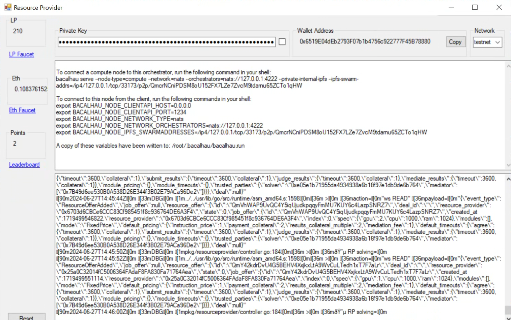

# Windows

This process involves downloading, installing, and setting up the Windows ResourceProvider application for Lilypad. Follow these steps to get your node up and running, and check its status on the leaderboard.


The ResourceProvider application is newly developed and we are actively working on improvements and appreciate your understanding as we refine its functionality!


### Prerequisites

* Nvidia GPU
* Nvidia drivers
* Nvidia docker drivers


For a more in-depth look at the requirements to run a Lilypad node, please refer to the [hardware requirements](https://docs.lilypad.tech/lilypad/\~/changes/Cw2DnBq7LVBF8K4yZnOf/hardware-providers/hardware-requirements) documentation.


### Installation

Download the zip file containing the necessary installation files [here](https://cdn.lilypad.tech/windows/WindowsResourceProviderSetup.zip). Once the zip file has been downloaded, open it and extract the files.


This application is compatible with Windows versions greater than 10.


Next, open the `setup.exe` file. This is what will install the ResourceProvider application, along with any dependencies you will need to run a node, including Lilypad, Docker and Bacalhau.&#x20;

Once the installation is complete, run ResourceProvider application.

### Network information and testnet tokens

Upon launching the ResourceProvider application, you will see two inputs at the top: one for your private key and one for your public address. The application generates a unique private key for you, or you can paste in a private key you have already generated.


If you import your own private key you will need to restart the application.


Next, you will need to import your private key into MetaMask. You can do this by following this [official MetaMask guide](https://support.metamask.io/managing-my-wallet/accounts-and-addresses/how-to-import-an-account/#importing-using-a-private-key).&#x20;

Once your private key has been imported, you will need to add the Arbitrum Sepolia Testnet network to your MetaMask. You can follow our [Setting up MetaMask guide](../../lilypad-testnet/quick-start/setting-up-metamask.md). When the network has been added, you will need to acquire some Arbitrum Sepolia and LP tokens.&#x20;

To do this, you can follow our [Funding your wallet](../../lilypad-testnet/quick-start/funding-your-wallet-from-faucet.md) documentation. Once you've followed this guide, you will be able to see your Arbitrum Sepolia and LP tokens once you're connected to the network.

### Running the node

With your account set up and funded, you can now run your node on Lilypad. The ResourceProvider application will do this automatically so long as it is open and running!

<figure><figcaption></figcaption></figure>

Once the node is up and running, you can confirm the status of the node in the [Lilypad leaderboard](https://info.lilypad.tech/leaderboard) by pasting your public address into the search bar.
