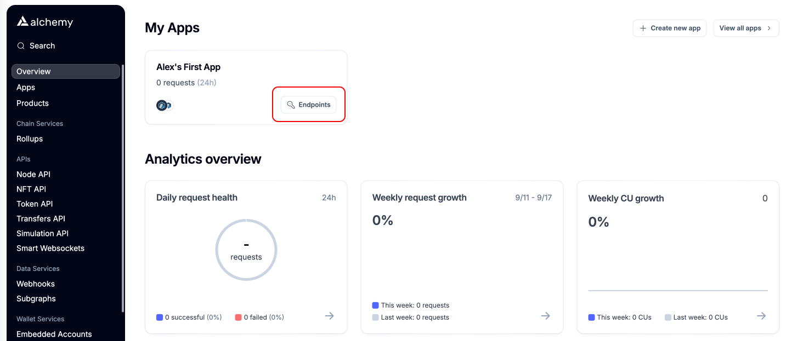
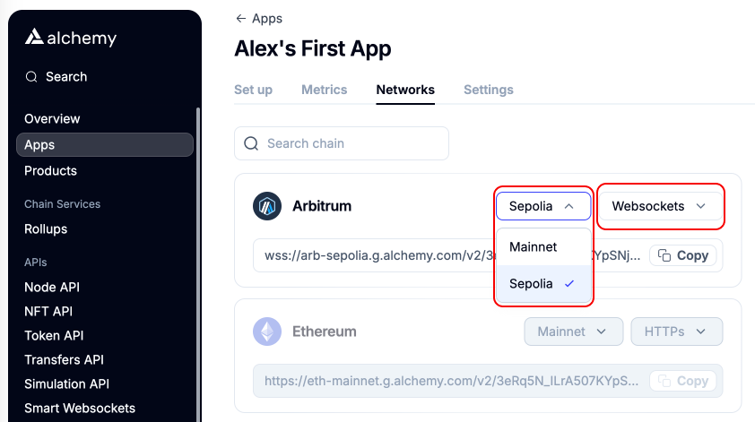
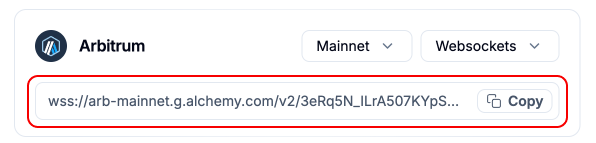

# Setup Arbitrum RPC

The Lilypad Network uses the Arbitrum Sepolia Testnet to settle compute transactions. This guide walks through the steps of setting up a personal RPC endpoint for Arbitrum Sepolia using [Alchemy](https://www.alchemy.com/).

This personal RPC endpoint allows Resource Providers (RP) to avoid reliability issues with the RPC endpoints used by Lilypad ensuring rewards can be earned and jobs can be run consistently. RPs running a personal RPC endpoint contribute to the fault tolerance and decentralization of the Lilypad Network! Read more in the Alchemy Arbitrum [docs](https://docs.alchemy.com/reference/arbitrum-api-quickstart).


The Lilypad Network is not responsible for issues caused by misconfigured Alchemy RPC endpoints. Please use at your own risk!


## Setup Alchemy account

[Create an account](https://dashboard.alchemy.com/) and login to the Alchemy dashboard.

Select a “free” account as the compute units provided should be sufficient to run a Lilypad RP. The free service provides 300 million compute units per month.

<figure><figcaption></figcaption></figure>

Select “skip bonus” or input a credit card with billing info (the card will not be charged unless the compute credits in the free tier are used).

## Setup RPC endpoint for Arbitrum Sepolia

In the “overview” section of the Alchemy dashboard, navigate to “My app” and select “Endpoints”. If an app was not created upon login, create a new one by selecting "Create new app"

<figure><figcaption></figcaption></figure>

By selecting “Endpoints”, the “Networks” tab will open providing an option to configure the Arbitrum API.

* Select “Sepolia”
* Select “Websockets”

<figure><figcaption></figcaption></figure>

The RPC endpoint for Arbitrum Sepolia is ready to be used with the Lilypad Resource Provider:

<figure><figcaption></figcaption></figure>

Metrics for the RPC can be viewed in the “Metrics” tab.

<figure><figcaption></figcaption></figure>

## Use the new RPC endpoint

Lilypad RPs are able to use a personal RPC endpoint with a few simple steps. Only Web-socket (WSS) connections are supported.

### **Docker users:**

```
docker run -d --gpus all -e WEB3_PRIVATE_KEY=<private-key> -e WEB3_RPC_URL=wss://arb-sepolia.g.alchemy.com/v2/some-id-from-alchemy --restart always ghcr.io/lilypad-tech/resource-provider:main
```

### **Ubuntu users:**

```
sudo nano /etc/systemd/system/lilypad-resource-provider.service
```

Add following line to \[Service] section

```
Environment="WEB3_RPC_URL=wss://arb-sepolia.g.alchemy.com/v2/some-alchemy-id"
```

<figure><figcaption></figcaption></figure>
