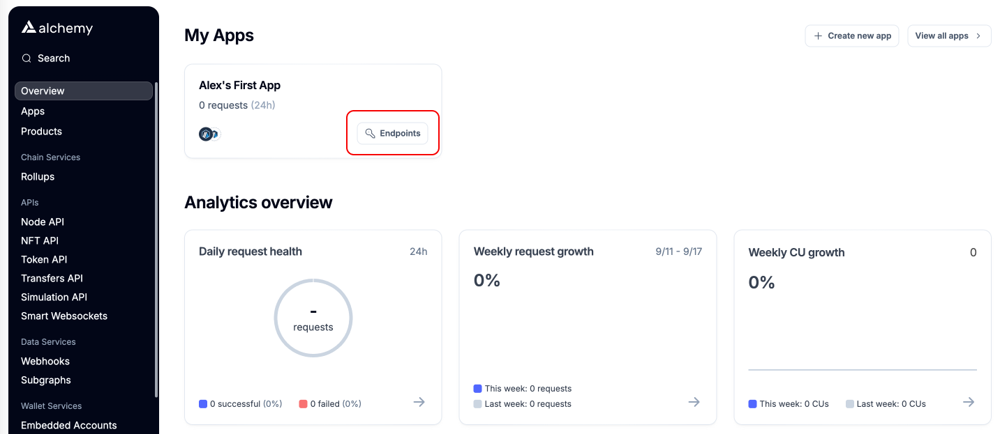
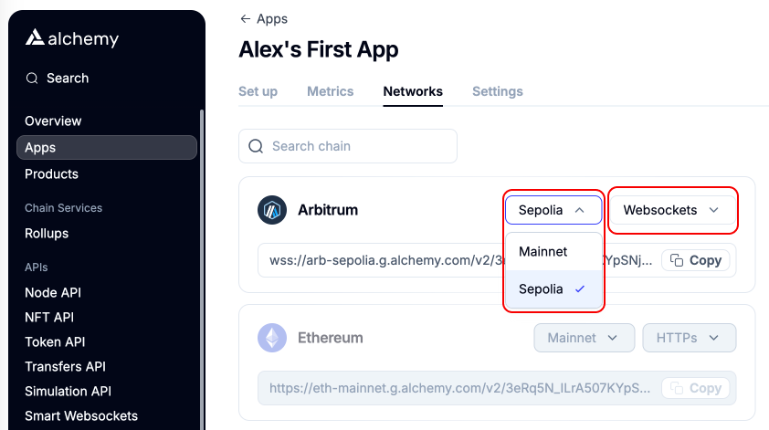

# Alchemy RPC

This guide walks through the steps of setting up a personal RPC endpoint for Arbitrum Sepolia using [Alchemy](https://www.alchemy.com/).


This guide demonstrates how to use Alchemy's RPC, but this can be substituted for any Arbitrum Sepolia RPC that supports WebSockets.


## Setup Alchemy account

[Create an account](https://dashboard.alchemy.com/) and login to the Alchemy dashboard.

Select the “free” tier as the compute units provided should be sufficient to run a Lilypad RP. The free service provides 300 million compute units per month.

<figure><figcaption></figcaption></figure>

Select “skip bonus” or input a credit card with billing info (the card will not be charged unless the compute credits in the free tier are used).

## Setup RPC endpoint for Arbitrum Sepolia

In the “Overview” section of the Alchemy dashboard, navigate to “My app” and select “Endpoints”. If an app was not created upon login, create a new one by selecting "Create new app".

<figure><figcaption></figcaption></figure>

By selecting “Endpoints”, the “Networks” tab will open providing an option to configure the Arbitrum API.

* Select “Sepolia”
* Select “Websockets”

<figure><figcaption></figcaption></figure>

The RPC endpoint for Arbitrum Sepolia is ready to be used with the Lilypad Resource Provider:

<figure><figcaption></figcaption></figure>

Metrics for the RPC can be viewed in the “Metrics” tab.

<figure><figcaption></figcaption></figure>

## Use the new RPC endpoint


This is guide is for individuals running a Lilypad Resource provider, find more info [here](https://docs.lilypad.tech/lilypad/hardware-providers/run-a-node).


Lilypad RPs can use a personal RPC endpoint with a few simple steps. Only Web-socket (WSS) connections are supported.

### **Docker users**

Stop the existing Lilypad Resource Provider (RP) before setting up the new RPC.&#x20;

Locate the Lilypad RP Docker container using:

```
docker ps
```

Stop the container using the PID:

```
docker stop <container ID>
```

Use this command to start the lilypad-resource-provider.service with the new RPC:

```
docker run -d --gpus all -e WEB3_PRIVATE_KEY=<private-key> -e WEB3_RPC_URL=wss://arb-sepolia.g.alchemy.com/v2/some-id-from-alchemy --restart always ghcr.io/lilypad-tech/resource-provider:latest
```

Check the status of the container:

```
docker logs <container ID>
```

### **Ubuntu users**

Stop the existing Lilypad RP (if the node is not running, disregard this first step):

```
sudo systemctl stop bacalhau
sudo systemctl stop lilypad-resource-provider
```

Update `lilypad-resource-provider.service` with the new RPC:

```
sudo nano /etc/systemd/system/lilypad-resource-provider.service
```

Add following line to \[Service] section:

```
Environment="WEB3_RPC_URL=wss://arb-sepolia.g.alchemy.com/v2/some-alchemy-id"
```

<figure><figcaption></figcaption></figure>

Reboot the node:

```
sudo reboot
```

If the Lilypad RP was [setup](https://docs.lilypad.tech/lilypad/hardware-providers/run-a-node/linux#install-systemd-unit-for-bacalhau) properly as a systemd service, the RP will reboot using the new RPC. Once the reboot is complete, the RP should be running with the updated configuration. To verify your node is back online and running correctly, run the following:

```
sudo systemctl status lilypad-resource-provider
sudo systemctl status bacalhau
```
