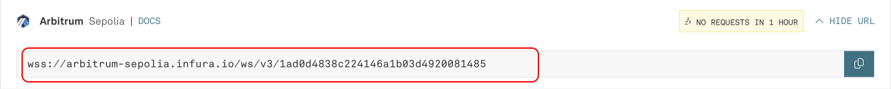

# Infura RPC

This guide walks through the steps of setting up a personal RPC endpoint for Arbitrum Sepolia using [Infura](https://www.infura.io/).


This guide demonstrates how to use Infura's RPC, but this can be substituted for any Arbitrum Sepolia RPC that supports WebSockets.


## Setup Infura account

&#x20;Create an account on Infura and choose your plan based on how many APIs you need.

Select the “free” tier as the compute units provided should be sufficient to run a Lilypad RP.

<figure><figcaption></figcaption></figure>

## Setup RPC endpoint for Arbitrum Sepolia

In the Infura dashboard, a new API key will usually be generated automatically. If not, select "Create New API Key".

<figure><figcaption></figcaption></figure>

Navigate to the Arbitrum network and ensure the Sepolia testnet box is checked, then save changes.

<figure><figcaption></figcaption></figure>

In the API key dashboard, select "Active Endpoints" and navigate to "WebSockets".

<figure><figcaption></figcaption></figure>

Scroll down the page to find the Arbitrum Sepolia URL. The RPC endpoint for Arbitrum Sepolia is ready to be used with the Lilypad Resource Provider:

<figure><figcaption></figcaption></figure>

## Use the new RPC endpoint


This is guide is for individuals running a Lilypad Resource provider, find more info [here](https://docs.lilypad.tech/lilypad/hardware-providers/run-a-node).


Lilypad RPs can use a personal RPC endpoint with a few simple steps. Only Web-socket (WSS) connections are supported.

### **Docker users**

Stop the existing Lilypad Resource Provider (RP) before setting up the new RPC.&#x20;

Locate the Lilypad RP Docker container using:

```
docker ps
```

Stop the container using the PID:

```
docker stop <container ID>
```

Use this command to start the lilypad-resource-provider.service with the new RPC:

```
docker run -d --gpus all -e WEB3_PRIVATE_KEY=<private-key> -e WEB3_RPC_URL=wss://arbitrum-sepolia.infura.io/ws/v3/some-id-from-infura --restart always ghcr.io/lilypad-tech/resource-provider:latest
```

Check the status of the container:

```
docker logs <container ID>
```

### **Ubuntu users**

Stop the existing Lilypad RP (if the node is not running, disregard this first step):

```
sudo systemctl stop bacalhau
sudo systemctl stop lilypad-resource-provider
```

Update `lilypad-resource-provider.service` with the new RPC:

```
sudo nano /etc/systemd/system/lilypad-resource-provider.service
```

Add following line to \[Service] section:

```
Environment="WEB3_RPC_URL=wss://arbitrum-sepolia.infura.io/ws/v3/some-id-from-infura"
```

Reboot the node:

```
sudo reboot
```

If the Lilypad RP was [setup](https://docs.lilypad.tech/lilypad/hardware-providers/run-a-node/linux#install-systemd-unit-for-bacalhau) properly as a systemd service, the RP will reboot using the new RPC. Once the reboot is complete, the RP should be running with the updated configuration. To verify your node is back online and running correctly, run the following:

```
sudo systemctl status lilypad-resource-provider
sudo systemctl status bacalhau
```
