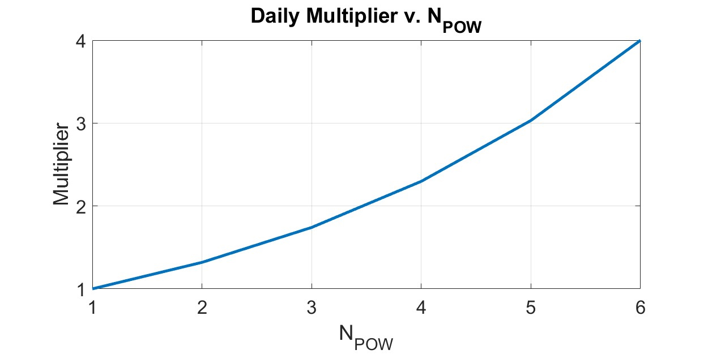

# Troubleshooting


Please view these resources before asking questions!

* [Lilybit Rewards info](https://blog.lilypadnetwork.org/update-to-the-lilybit-rewards-calculation)
* [Lilybit Leaderboard](https://info.lilypad.tech/leaderboard)


## Don't see your issue below?

For **complex issues, bug reports, or feature requests,** open a discussion in the Lilypad-Tech Github organization discussion [board](https://github.com/orgs/Lilypad-Tech/discussions).&#x20;

* Navigate to the discussion [board](https://github.com/orgs/Lilypad-Tech/discussions), select "New Discussion", choose "rp-issues", and fill out the template.&#x20;
* Without a discussion opened, our team will not be able to support the problem.

**For quick questions or minor issues,** use the Lilypad Discord [#i-need-help](https://discord.com/channels/1212897693450641498/1230231823674642513) channel and provide the following info.

* Description (including Lilypad version running on your node)
* Hardware Info (including Linux/Windows version)
* Related blockchain/ETH addresses of transaction hashes
* Output Logs - `sudo systemctl status lilypad-resource-provider`
* Related links/urls
* Screenshots


**IMPORTANT:** When sharing screenshots of your logs or node information, make sure to **remove or block out any references to your node's private key.** Keeping your private key safe and away from the public eye is crucial!


## FAQ

### I haven’t seen any PoW -> Common issues to check first!

1. Ensure the RP (node) is running the latest [Lilypad version](https://docs.lilypad.tech/lilypad/hardware-providers/run-a-node#update-lilypad-version) for your preferred environment
2. Confirm network activity. Is the RP transacting on [Arbiscan](https://sepolia.arbiscan.io/) (Sepolia) with transactions verified and running consistently?

* Is the RP online in the [Leaderboard](https://info.lilypad.tech/leaderboard) and in the [node status dashboard](https://info.lilypad.tech/node-status)?

3. If the RP public keys are not found within the Arbiscan network or Leaderboard

* does the RP have [enough](https://docs.lilypad.tech/lilypad/hardware-providers/run-a-node#fund-your-wallet-with-eth-and-lp) Lilypad Tokens (LP) and Arbitrum ETH?

4. Updating and restarting the Lilypad services regularly (daily) is encouraged throughout IncentiveNet.

## Run a node

### How do I keep track of Lilypad version releases and other important announcements?

The [updates-rp](https://discord.com/channels/1212897693450641498/1256179769356189707) Discord channel is the primary location for Resource Provider announcements. Announcements in this channel are also posted on the Lilypad [updates](https://updates.lilypad.tech/) page.

### How do I setup a Lilypad node?

Check out this [video guide](https://www.youtube.com/watch?v=slCLg35rAU4) for setting up a Lilypad node using Ubuntu Linux. Note, you may notice in the Metamask setup part of the video the Network name and RPC URL are old. Disregard this, the video was recorded with our old testnet info not the current Lilypad testnet [details](https://docs.lilypad.tech/lilypad/lilypad-testnet/quick-start/setting-up-metamask) on Arbitrum. Otherwise, the directions here are current.

Read more about running a Lilypad node in the [docs](https://docs.lilypad.tech/lilypad/hardware-providers/run-a-node).



### Is my node online and earning rewards?

To view the status of a Lilypad Resource Provider ensuring points are earned, follow the steps below or check out this [video guide](https://www.youtube.com/watch?v=ul7qXVh4wRM).

* Check the wallet used by the RP to ensure it has enough Arbitrum Sepolia ETH and LP tokens
* Search the wallet ID on Arbiscan to view transactions occurring every hour
* View points earned in the [Leaderboard](https://info.lilypad.tech/leaderboard)



After following the checklist above, if needed restart the node.

**Restart lilypad and bacalhau services**

```bash
sudo systemctl restart lilypad
sudo systemctl restart bacalhau
```

If this doesn't solve the problem, [raise a ticket](https://discord.com/channels/1212897693450641498/1230231823674642513) with our team.

### Can I become a Lilypad Resource Provider with just a CPU and no GPU?

Resource Providers can run on the Lilypad Network without a GPU, however only hardware with a GPU is currently rewarded with Lilybit\_ rewards.

### Can I run a Lilypad RP on Windows?

Lilypad RPs currently only support Linux installs. Running a RP on Windows is currently experimental.

### How do I run multiple GPU’s on one server?

Recommendation guide using Proxmox found [here](https://github.com/Lilypad-Tech/lilypad-tools/blob/main/proxmox/multi-gpu-proxmox.md). More on this coming soon!

### Can I run multiple Lilypad RPs on one GPU?

No, this would be considered detrimental to the Lilypad network and cannot be rewarded.&#x20;

In order to run jobs successfully, Lilypad RPs must ensure all resources on the server are available. If a single GPU is running many RPs and splitting the server resources between them, this causes each RP to not have enough resources to run a Lilypad job.

### How do I setup a personal RPC for Arbitrum Sepolia?

Here's a quick guide on setting up your own RPC for a Lilypad node.



### How do I change my Bacalhau version?

First, if the Lilypad node is running, stop the system (if the node is not running, disregard this first step):

```bash
sudo systemctl stop bacalhau
sudo systemctl stop lilypad-resource-provider
```

Uninstall Bacalhau:

```bash
sudo rm -rf /usr/bin/bacalhau
```

Reinstall Bacalhau using [the guide](https://docs.lilypad.tech/lilypad/hardware-providers/run-a-node/linux#install-bacalhau) in the docs.

Finally, start the resource provider:

```bash
sudo systemctl start bacalhau
sudo systemctl start lilypad-resource-provider
```

### Bacalhau ipfs init error

One fix is to install kubo (goipfs) and then export the path to `/app/data/ipfs` using:

```bash
export IPFS_PATH=/app/data/ipfs
```

Export the path first, then turn Bacalhau back on and see if that corrects it.

### CompatNotSupportedOnDevice Error

The CUDA version of the RP does not match the GPU driver. Please refer to this [Nvidia GPU Driver guide](https://docs.nvidia.com/deploy/cuda-compatibility) to repair installation.

### Unknown Error Code: 222

Indicates that the CUDA version of the RP is incorrect. Install the CUDA version which suitable for the gpu type and compile Lilypad by themselves.

### **How can I check the status of my Lilypad node once it's running?**

To check if the RP is running use the following command:

```bash
sudo systemctl status lilypad-resource-provider
```

This will give a live output from the Lilypad node. The logs will show the node running and accepting jobs on the network.

Run the following command to get more info from your node:

```bash
sudo journalctl -u lilypad-resource-provider.service -f
```

Read more in the [Linux](https://docs.lilypad.tech/lilypad/hardware-providers/run-a-node/linux#view-node-status) instructions.

## Lilypad  IncentiveNet details

### When do Lilybit\_ rewards earned or rewards slashed appear in the Leaderboard?

Once a day at 00:10 UTC. If no rewards appear after 24 hours of expected uptime, view the logs and Arbiscan transactions from the resource provider to ensure online status.

### How does slashing work on Lilypad?

The slashing mechanism now uses a tiered/progressive system to more fairly slash RPs. Penalties will increase progressively the longer the node remains online. 1-5 days offline will result in a 2.5% slash per day, 5-10 days offline a 5% slash per day, and more than 10 days offline a 10% slash per day.

A grace period for RP downtime is now included in the slashing mechanism. RPs will earn 2 days of a “grace period” after every 30 days of continuous service provided.&#x20;

* These 2 days will be applied to 2 subsequent down days recorded by the RP allowing the RP to avoid slashing for these 2 days.&#x20;
* Grace Period days do not accumulate to more than 2 days ever. Once used the 30 day count to obtain the 2 days restarts.

### Will I lose reward multipliers if my node is offline?

The way the system is setup currently, a RP will lose the [4X daily multiplier](https://blog.lilypadnetwork.org/incentivenet-lilybit-reward-calculations) if the hashrate call (every 4 hours) is missed. If the PoW happens in the window of time that a node is restarting/offline, then it's missed.

However, a RP will still receive a multiplier relative to how many 4-hour windows of POWs completed in that day. This figure shows the daily multiplier for a given number of 4-hour windows of POWs completed in a day.

<figure><figcaption></figcaption></figure>

### Are **there required updates needed to maintain my node software with Lilypad on IncentiveNet?**

Resource providers are expected to have the latest Lilypad version installed on their systems. The installation instructions can be found here:

* [Linux](https://docs.lilypad.tech/lilypad/hardware-providers/run-a-node/linux#update-lilypad-version)
* [Docker](https://docs.lilypad.tech/lilypad/hardware-providers/run-a-node/docker#enable-automatic-updates)

To stay up to date with the latest releases, check the [updates-rp channel](https://discord.com/channels/1212897693450641498/1256179769356189707) in the Lilypad Discord or visit the [Lilypad GitHub](https://github.com/Lilypad-Tech/lilypad). Along the top menu, click the "Watch" dropdown and you will see a section named "Custom". Selecting "Releases" will allow you to get notified of any new releases!

### Can Lilybit rewards be sent to another wallet? Will this function be added in the future?

Currently, it's not possible. However, it's a very good feature request and the team is evaluating!

### I’m getting an error of “invalid hex character 'r' in private key”

This is more than likely due to you trying to export your mnemonic seed phrase instead of the private key. A private key typically appears like this: `4c0883a69102937d6231471b5dbb6204fe512961708279df95b4a2200eb6b5e7` and consists of 64 hexadecimal characters.

Check out the [MetaMask official guide to retrieve your private key](https://support.metamask.io/managing-my-wallet/secret-recovery-phrase-and-private-keys/how-to-export-an-accounts-private-key/).

### How do I setup my Metamask wallet?

* [Import](https://docs.lilypad.tech/lilypad/lilypad-testnet/quick-start/setting-up-metamask#setting-up-metamask) a custom network (Lilypad)
* [Locate](https://support.metamask.io/managing-my-wallet/secret-recovery-phrase-and-private-keys/how-to-export-an-accounts-private-key/) a wallet's Private Key
* [Import](https://docs.lilypad.tech/lilypad/lilypad-testnet/quick-start/setting-up-metamask#import-the-testnet-lp-token) the Lilypad Token to a wallet

### How do I get testnet LP and ETH (Arbitrum Sepolia ETH)?

* [Fund](https://docs.lilypad.tech/lilypad/lilypad-testnet/quick-start/funding-your-wallet-from-faucet) a wallet with LP and ETH
* No ETH or LP in your wallet? ([import custom network and import the tokens](https://docs.lilypad.tech/lilypad/lilypad-testnet/quick-start/setting-up-metamask#import-the-testnet-lp-token))

Join our [Discord](https://lilypad.team/discord) for more help!
