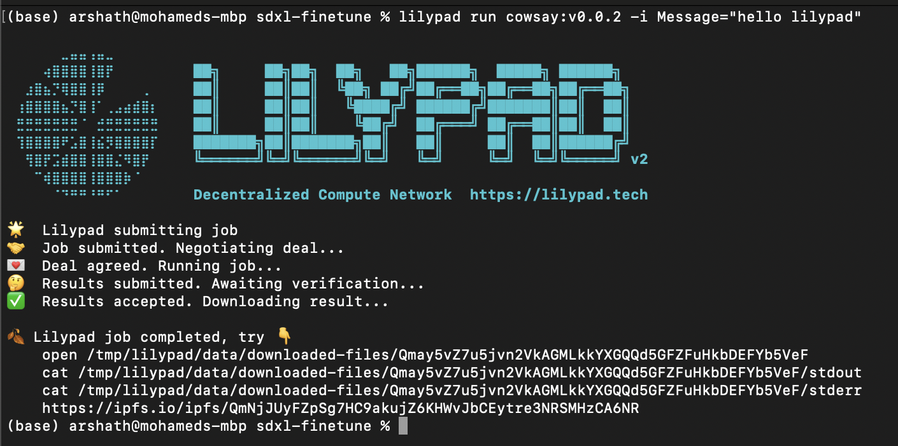
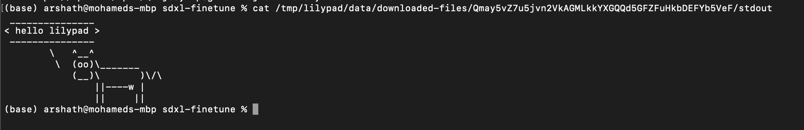

# Hello (cow) World! in Sepolia Network

## Getting LilyPad Tokens

To acquire LilyPad tokens, follow these steps:

1. Visit the Lilypad Faucet at [35.222.207.181:8081](http://35.222.207.181:8081/)
2. Enter your wallet address.
3. Receive some LP tokens.

## Setting up Environment Variables

Set the environment variables as shown below:

```bash
export WEB3_CHAIN_ID=11155111
export WEB3_RPC_URL=https://sepolia.infura.io/v3/[YOUR_INFURA_API_KEY]
export WEB3_CONTROLLER_ADDRESS=0x433C91FA54b9c11550b07672E1FA2b06860e5b05
export WEB3_TOKEN_ADDRESS=0x90bC5e91B2bC6BBa240001B169fd73DeA75E072A
export WEB3_MEDIATION_ADDRESS=0xe294485d0C03adCe1BE2c2791522A6c0585A4f7B
export WEB3_JOBCREATOR_ADDRESS=0x4aC3C9F7e431dce628440b5037d23890c28E5C3F
export WEB3_PAYMENTS_ADDRESS=0xC5b1737A2282E6283c54f67bC401426058BC170F
export WEB3_STORAGE_ADDRESS=0x79Ee2d28eDDd9Ee0b68613b29Dab474623F8D1c6
export WEB3_USERS_ADDRESS=0x70eC3b0aFA059174dD54d7702624f1Dd402b706b
export SERVICE_SOLVER="0x08D118d3300c82CD94a4080805426AB025fe9852"
export SERVICE_MEDIATORS="0xd6244f8c08d4b7bb7ccbd72e585b19ee68a8d1eb"
```

## Running cowsay
>Note: Ensure that you have Lilypad installed before proceeding.

To execute cowsay, use the following command:

```bash
lilypad run cowsay:v0.0.1 -i Message="<hello lilypad>"
```

**Output:**
<figure><figcaption><p>Probably nothing...</p></figcaption></figure>

## See the Results <a href="#see-the-results" id="see-the-results"></a>

1. see the results by navigating to the IPFS CID
Navigate to the IPFS CID result output in the Results -> [https://ipfs.io/ipfs/QmNjJUyFZpSg7HC9akujZ6KHWvJbCEytre3NRSMHzCA6NR](https://ipfs.io/ipfs/QmNjJUyFZpSg7HC9akujZ6KHWvJbCEytre3NRSMHzCA6NR)


This could take up to a minute to propagate through the IPFS network. Please be patient


2. by navigting to the local folder
```bash
open /tmp/lilypad/data/downloaded-files/Qmay5vZ7u5jvn2VkAGMLkkYXGQQd5GFZFuHkbDEFYb5VeF
```
Here, you can view the `stdout` and `stderr` as well as the `outputs` folder for the run
<figure><figcaption><p>The Results....</p></figcaption></figure>