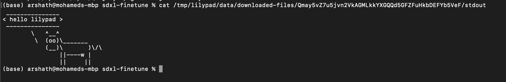

# Hello (cow) World!

## Run Hello, 🐮 World! Job \[CLI] <a href="#run-hello-world-job" id="run-hello-world-job"></a>


Ensure you have installed all requirements [install-run-requirements.md](../lilypad-aurora-testnet/quick-start/install-run-requirements.md "mention")


1. Start Docker

2. Open a Terminal window and run the following command

3. Make sure to have the following env in your shell session

```
export SERVICE_SOLVER="0x3C44CdDdB6a900fa2b585dd299e03d12FA4293BC"
export SERVICE_MEDIATORS="0x90F79bf6EB2c4f870365E785982E1f101E93b906"
export WEB3_PRIVATE_KEY=YOUR_PRIVATE_KEY

```
4. Run `lilypad`
```bash
lilypad run cowsay:v0.0.2 "hello lilypad"
```

(ensure your user is in the docker group if necessary on your platform)\
\
**Output:**

<figure><figcaption><p>Probably nothing...</p></figcaption></figure>

### See the Results <a href="#see-the-results" id="see-the-results"></a>

1. see the results by navigating to the IPFS CID
Navigate to the IPFS CID result output in the Results -> [https://ipfs.io/ipfs/QmNjJUyFZpSg7HC9akujZ6KHWvJbCEytre3NRSMHzCA6NR](https://ipfs.io/ipfs/QmNjJUyFZpSg7HC9akujZ6KHWvJbCEytre3NRSMHzCA6NR)


This could take up to a minute to propagate through the IPFS network. Please be patient


2. by navigting to the local folder
```bash
open /tmp/lilypad/data/downloaded-files/Qmay5vZ7u5jvn2VkAGMLkkYXGQQd5GFZFuHkbDEFYb5VeF
```
Here, you can view the `stdout` and `stderr` as well as the `outputs` folder for the run
<figure><figcaption><p>The Results....</p></figcaption></figure>


## Run Hello,🐮 World! Job \[Smart Contract] <a href="#run-hello-world-job" id="run-hello-world-job"></a>

