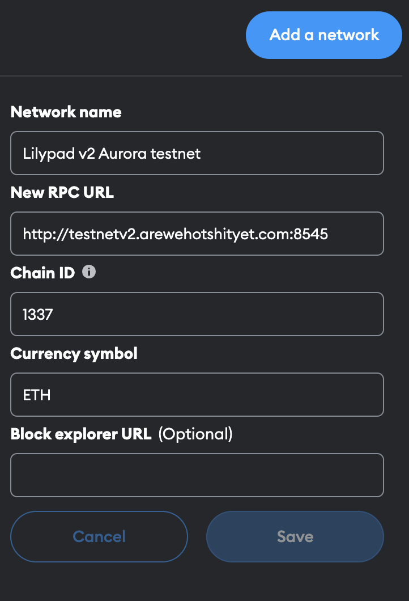

# Setting up Metamask

## Setting up Metamask

* Install metamask Extension [here](https://metamask.io/)
* Next, add the Lilypad Testnet chain to metamask.


Network name: `Lilypad v2 Aurora testnet`

New RPC URL: `http://testnet.lilypad.tech:8545`

Chain ID: `1337`

Currency symbol: lil`ETH`

Block explorer URL: (leave blank)


To do this, open metamask then click on the network button at the top left of the popup (in the menu bar):

##  (1) (1) (1).png>) \`\`   (1) (1) (1).png>)

Then click the "Add Network" Button.&#x20;

<figure><figcaption></figcaption></figure>

Next, click on "Add a network manually" at the bottom of the page and enter the Lilypad Testnet details:

<figure><figcaption></figcaption></figure>

Click Save. :tada:

