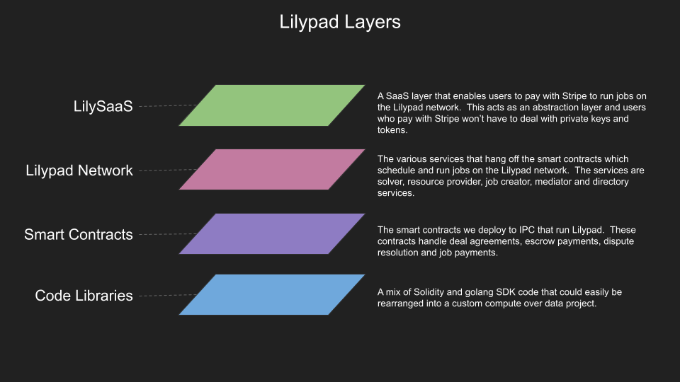
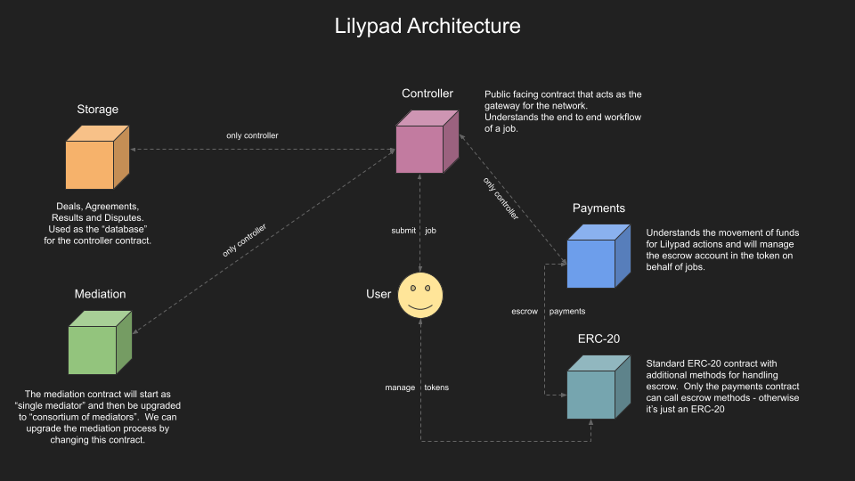
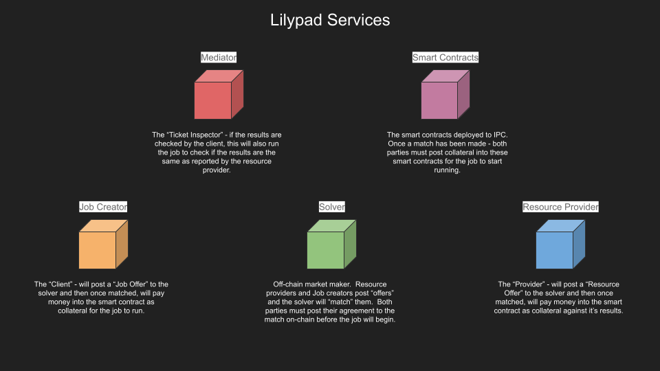

# Architecture

This page is a dynamic work in progress! We're working on some better diagrams!


See the [whitepaper.md](../research-and-vision/whitepaper.md "mention") for further information on how the MODICUM architecture was enhanced in implementation

See [docs.bacalhau.org](https://docs.bacalhau.org) for more information on how Bacalhau operates


### Lilypad Technical Architecture

<figure><figcaption>
Components of the Lilypad Ecosystem: From SaaS to Smart Contracts
</figcaption></figure>

<figure><figcaption>
Main architecture of the Lilypad Ecosystem
</figcaption></figure>

<figure><figcaption>
Services in the Lilypad Ecosystem
</figcaption></figure>

### Based on Academic Research

The architecture of Lilypad is inspired by the research paper titled "Mechanisms for Outsourcing Computation via a Decentralized Market." The paper introduces MODiCuM, a decentralized system that allows for computational outsourcing in an open market. Just like MODiCuM, Lilypad aims to create an open market of computational resources by introducing various decentralized services like solver, resource provider, job creator, mediator, and directory services. MODiCuM's unique approach to deterring misbehavior in a decentralized environment through dedicated mediators and enforceable fines has influenced Lilypad's own design, particularly in the areas of dispute resolution and system integrity.

For an in-depth understanding, you can read the paper [here](https://arxiv.org/abs/2005.11429).

> **Abstract of the paper**:\
> Mechanisms for Outsourcing Computation via a Decentralized Market As the number of personal computing and IoT devices grows rapidly, so does the amount of computational power that is available at the edge. Since many of these devices are often idle, there is a vast amount of computational power that is currently untapped, and which could be used for outsourcing computation. Existing solutions for harnessing this power, such as volunteer computing (e.g., BOINC), are centralized platforms in which a single organization or company can control participation and pricing. By contrast, an open market of computational resources, where resource owners and resource users trade directly with each other, could lead to greater participation and more competitive pricing. To provide an open market, we introduce MODiCuM, a decentralized system for outsourcing computation. MODiCuM deters participants from misbehaving-which is a key problem in decentralized systems-by resolving disputes via dedicated mediators and by imposing enforceable fines. However, unlike other decentralized outsourcing solutions, MODiCuM minimizes computational overhead since it does not require global trust in mediation results. We provide analytical results proving that MODiCuM can deter misbehavior, and we evaluate the overhead of MODiCuM using experimental results based on an implementation of our platform.

### Developer Experience and Determinism: A Talk by Luke Marsden

In this insightful presentation, Luke Marsden, a core member of the Lilypad project, delves into the complex relationship between determinism and developer experience. He highlights the necessity for determinism in verification systems and discusses the challenges of implementing it during runtime. The talk also covers the project's strategy to separate module creators from end-users and to provide a curated list of deterministic modules. Key points in the roadmap like improving user experience, decentralizing mediators, and automating determinism checks are also touched upon. The presentation concludes with a live demo of running AI jobs on Lilypad V2.


Lilypad Aurora: Technical Deep Dive & Demo

