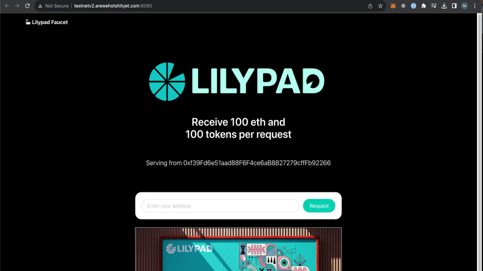
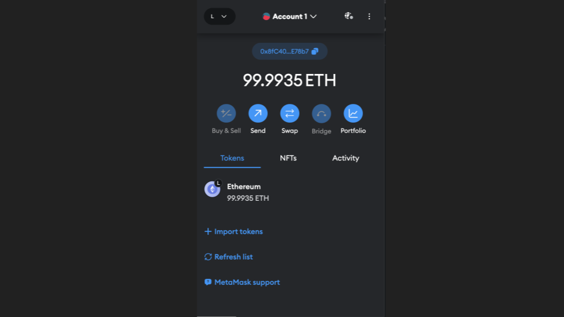

# Funding your wallet

## Funding your wallet

To obtain funds, connect to the Lilypad v3 Milkyway testnet network on your wallet and head to the faucet at `http://faucet.lilypad.tech` to get ETH and LP.


Faucet: [Testnet](http://faucet.lilypad.tech)


Copy your MetaMask wallet address into the bar and click the request button.

<figure><figcaption>
Aurora Testnet Faucet
</figcaption></figure>

Yay we're rich! :moneybag:

<figure><figcaption></figcaption></figure>
