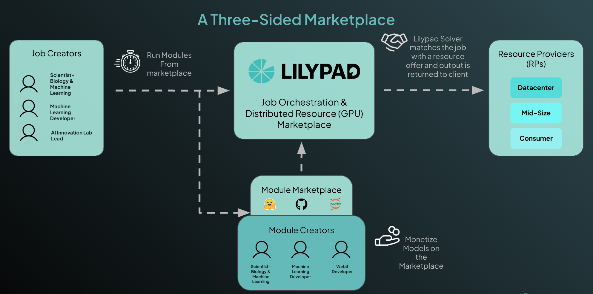

# Modules Intro

Lilypad is a three-sided marketplace between Module Creators, Job Creators, and Resource Providers.

## Modules Intro

Lilypad modules are the compute jobs that are run on the Lilypad network of Resource Provider nodes. Lilypad nodes are set up to run GPU compute jobs such as AI inference, and can be used for other GPU-intensive tasks.

<figure><figcaption>
Lilypad Modules Creators and Job Creators create and run modules on Resource Providers
</figcaption></figure>

There are two ways that participants in the network can interact with Lilypad Modules: As _Job Creators_ who run modules, or as _Module Creators_ who create modules.

### Run Modules

Running Jobs (participating as a 'Job Creator') is just a few simple steps. You can get going in less than 15 minutes:

* [**Install the CLI** ](../lilypad-testnet/install-run-requirements.md)or **Use the API** (Coming Soon)
* [**Set up a Metamask Wallet**](../lilypad-testnet/quick-start/setting-up-metamask.md) then [**Fund your wallet**](../lilypad-testnet/quick-start/funding-your-wallet-from-faucet.md) with Lilypad tokens to run the jobs and get Arbitrum Sepolia Testnet ETH from one of the many faucets for network gas fees to execute jobs.
* Choose a module to run, and send the job request

#### **Example Modules**

There is a basic example [cowsay module](hello-cow-world.md) you can run, or try out some of the Lilypad team-supported modules:

* [**Llama 2**](llama2.md)
* [**Stable Diffusion (SDXL0.9 & 1.0)**](stable-diffusion-sdxl0.9.md)
* [**Stable Diffusion Turbo Pipeline**](stable-diffusion-turbo-pipeline.md)
* [**Stable Diffusion Video (SDV1.0 & 1.1)**](stable-diffusion-video-sdv1.0-and-1.1.md)
* [**Llama LLM**](llama-llm.md)

Additional modules from the community are available in the [awesome-lilypad repo](https://github.com/Lilypad-Tech/awesome-Lilypad?tab=readme-ov-file#modules)

### Create Modules

Modules can be developed by any member of the community (participating as a 'Module Creator'). If there is an AI model (or other compute job) you wish to run using the Lilypad Network resources, you can simply:

* Containerize your module
* Create a [Lilypad Config File](https://github.com/Lilypad-Tech/lilypad-module-cowsay/blob/main/lilypad_module.json.tmpl)
* Test your modules

See more in [**Build a Job Module**](../developer-resources/build-a-job-module.md)
