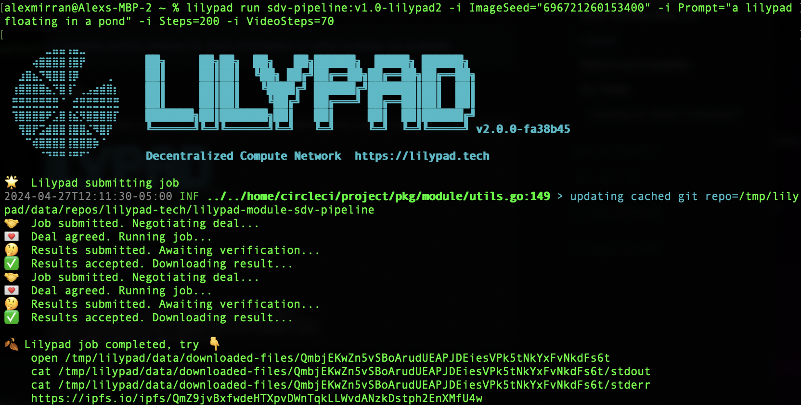
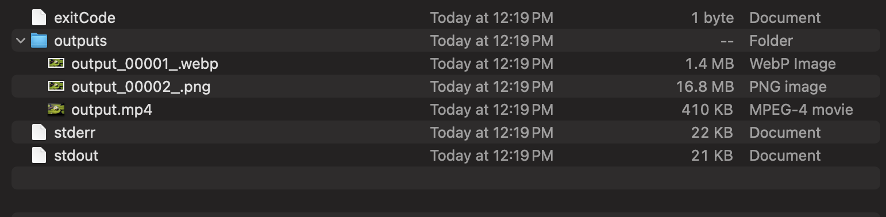

# Stable Diffusion Video (SDV1.0 & 1.1)

## Overview

Based on ComfyUI, the SDV Pipeline modules for Lilypad allow you generate videos from text prompts on Lilypad using Stable Diffusion Video and related models.&#x20;

The SDV Pipeline modules are designed to take your text prompt, generate a still frame using SDXL, then use that as the input to the SDV model, producing an APNG (animated PNG), WebP video, and an MP4 video all in one go.

## Getting Started

### Prerequisites

Before running `sdv`, make sure you have the [Lilypad CLI installed](https://docs.lilypad.tech/lilypad/lilypad-milky-way-testnet/install-run-requirements) on your machine and your private key environment variable is set. This is necessary for operations within the Lilypad network.

```bash
export WEB3_PRIVATE_KEY=<YOUR_PRIVATE_KEY>
```

### Running SDV v1.0 or 1.1

To run SDV v1.0 or 1.1 Pipeline in Lilypad, you can use the following commands:

#### SDV 1.0

```bash
lilypad run sdv-pipeline:v1.0-lilypad2 -i ImageSeed="696721260153400" -i Prompt="an astronaut floating against a white background" -i Steps=200 -i VideoSteps=70
```

#### SDV 1.1

```bash
lilypad run sdv-pipeline:v1.1-lilypad2 -i ImageSeed="696721260153400" -i Prompt="an astronaut floating against a white background" -i Steps=200 -i VideoSteps=70
```

### SDV Output

<figure><figcaption></figcaption></figure>

To view the results in a local directory, navigate to the local folder.

```bash
open /tmp/lilypad/data/downloaded-files/QmbjEKwZn5vSBoArudUEAPJDEiesVPk5tNkYxFvNkdFs6t
```

<figure><figcaption></figcaption></figure>

To view the results on IPFS, navigate to the IPFS CID result output.


Please be patient! IPFS can take some time to propagate and doesn't always work immediately.


```bash
https://ipfs.io/ipfs/QmZ9jvBxfwdeHTXpvDWnTqkLLWvdANzkDstph2EnXMfU4w
```


**Results of SDV job on Output Directory**


As Lilypad modules are currently deterministic, running this command with the same text prompt will produce the same image, since the same seed is also used (the default seed is 0).

### Specifying tunables

If you wish to specify more than one tunable, such as the number of steps, simply add more `-i` flags. For example, to change or improve the quality of the image generated add "Steps=x" with x = (min: 5. Max: 200):

```bash
lilypad run sdv-pipeline -i Prompt="an astronaut floating against a white background" -i Steps=69
```


See the [options and tunables](stable-diffusion-video-sdv1.0-and-1.1.md#options-and-tunables) section for more information on what tunables are available.



See this [beginner-friendly article](https://aituts.com/stable-diffusion-seed/) on how seeds work for more info on this


## Options and tunables

The following tunables are available. All of them are optional, and have default settings that will be used if you do not provide them.

| Name             | Description                                    | Default                           | Available options                                                                                                                                                                                                                                                                                         |
| ---------------- | ---------------------------------------------- | --------------------------------- | --------------------------------------------------------------------------------------------------------------------------------------------------------------------------------------------------------------------------------------------------------------------------------------------------------- |
| `Prompt`         | A text prompt for the model                    | "question mark floating in space" | Any string                                                                                                                                                                                                                                                                                                |
| `Framerate`      | The framerate of the video                     | 8                                 | Any valid positive integer between 1 and 20                                                                                                                                                                                                                                                               |
| `Seed`           | A seed for the image model                     | 42                                | Any valid non-negative integer                                                                                                                                                                                                                                                                            |
| `Steps`          | The number of steps to run the model for       | 50                                | Any valid non-negative integer from 5 to 200 inclusive                                                                                                                                                                                                                                                    |
| `Scheduler`      | The scheduler to use for the model             | `normal`                          | `normal`, `karras`, `exponential`, `sgm_uniform`, `simple`, `ddim_uniform`                                                                                                                                                                                                                                |
| `Sampler`        | The sampler to use for the model               | `euler_ancestral`                 | `"euler"`, `"euler_ancestral"`, `"heun"`, `"heunpp2"`, `"dpm_2"`, `"dpm_2_ancestral"`, `"lms"`, `"dpm_fast"`, `"dpm_adaptive"`, `"dpmpp_2s_ancestral"`, `"dpmpp_sde"`, `"dpmpp_sde_gpu"`, `"dpmpp_2m"`, `"dpmpp_2m_sde"`, `"dpmpp_2m_sde_gpu"`, `"dpmpp_3m_sde"`, `"dpmpp_3m_sde_gpu"`, `"ddpm"`, `"lcm"` |
| `Batching`       | How many images to produce                     | `1`                               | `1`, `2`, `4`, `8`                                                                                                                                                                                                                                                                                        |
| `VideoSeed`      | A seed for the video model                     | 42                                | Any valid non-negative integer                                                                                                                                                                                                                                                                            |
| `VideoSteps`     | The number of steps to run the video model for | 50                                | Any valid non-negative integer from 5 to 70 inclusive                                                                                                                                                                                                                                                     |
| `VideoScheduler` | The scheduler to use for the video model       | `normal`                          | `normal`, `karras`, `exponential`, `sgm_uniform`, `simple`, `ddim_uniform`                                                                                                                                                                                                                                |
| `VideoSampler`   | The sampler to use for the video model         | `euler_ancestral`                 | `"euler"`, `"euler_ancestral"`, `"heun"`, `"heunpp2"`, `"dpm_2"`, `"dpm_2_ancestral"`, `"lms"`, `"dpm_fast"`, `"dpm_adaptive"`, `"dpmpp_2s_ancestral"`, `"dpmpp_sde"`, `"dpmpp_sde_gpu"`, `"dpmpp_2m"`, `"dpmpp_2m_sde"`, `"dpmpp_2m_sde_gpu"`, `"dpmpp_3m_sde"`, `"dpmpp_3m_sde_gpu"`, `"ddpm"`, `"lcm"` |

Learn more about this Lilypad module on [Github](https://github.com/Lilypad-Tech/lilypad-module-sdv-pipeline).
