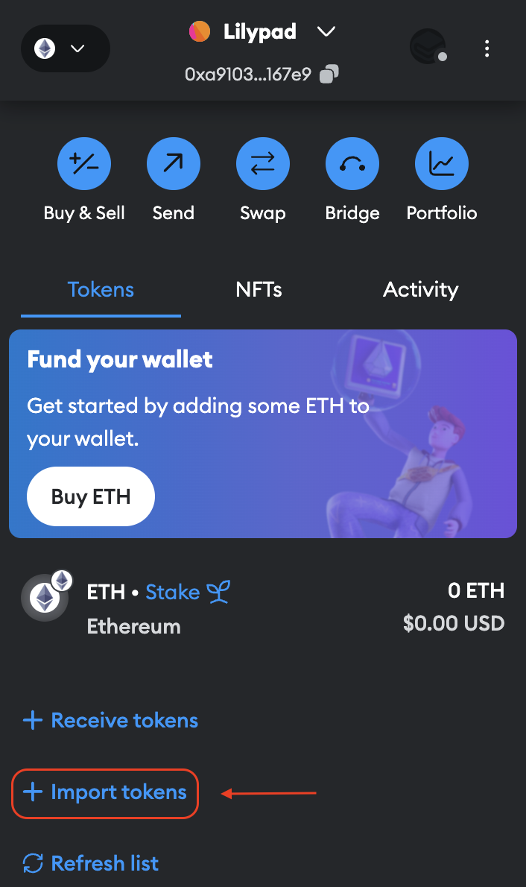
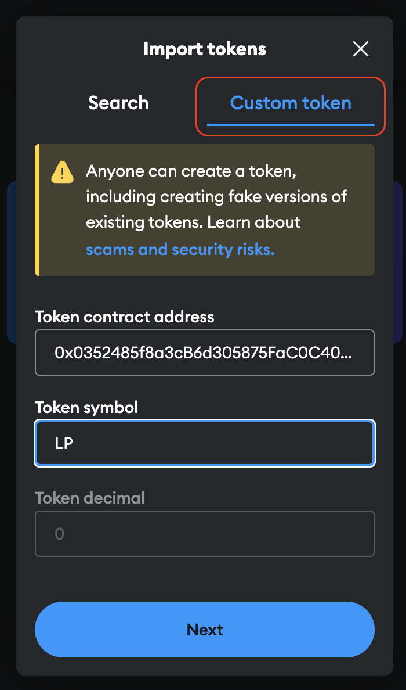
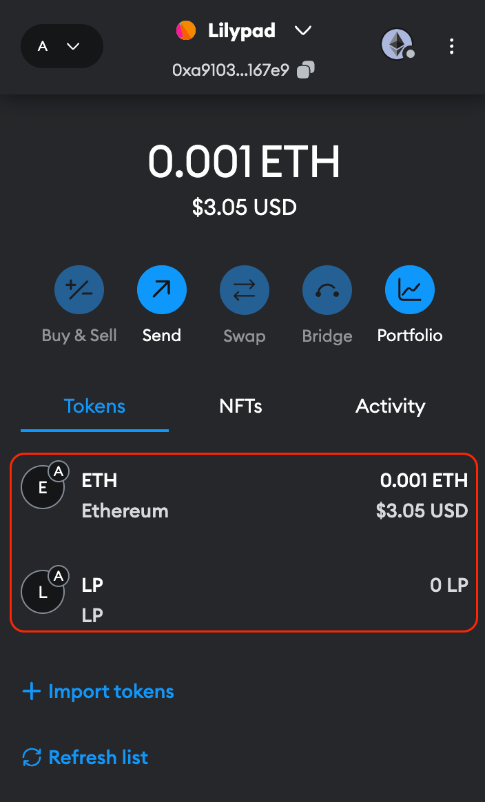
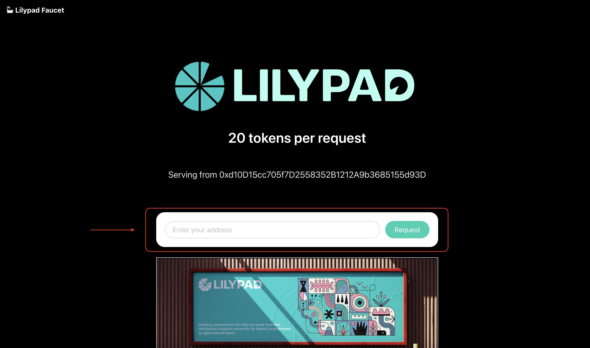
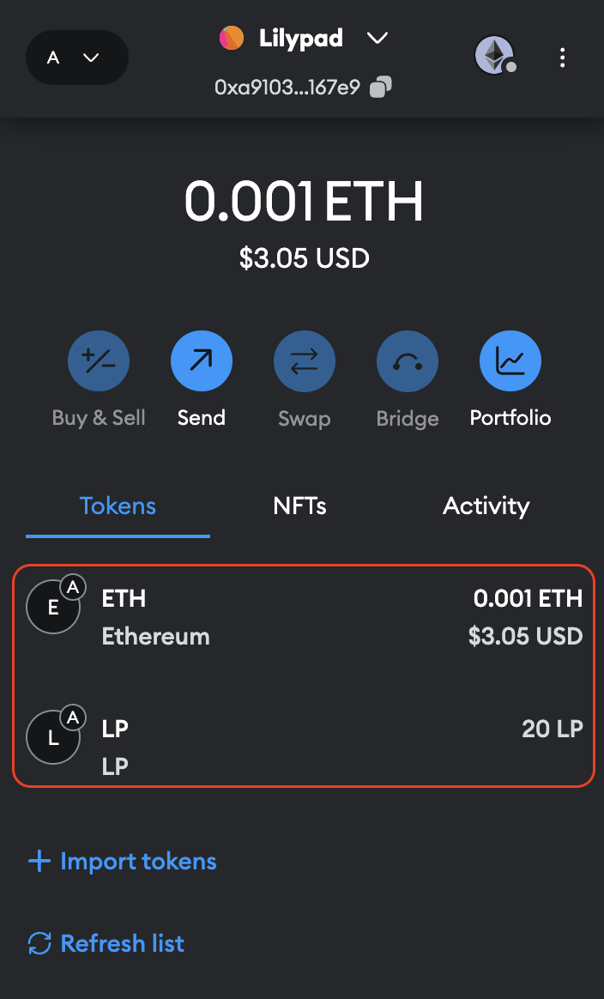

# Funding your wallet

**tldr:** To obtain funds, first connect your wallet to the Arbitrum Sepolia network. Collect the following tokens from the faucets:

* [Lilypad Testnet tokens (LP) ](https://faucet-testnet.lilypad.tech/)
* [Arbitrum Sepolia ETH](https://arbitrum.faucet.dev/ArbSepolia) (3rd party faucet list)

## Step by step guide

### Import Testnet LP tokens

After [setting up your wallet](https://docs.lilypad.tech/lilypad/lilypad-testnet/quick-start/setting-up-metamask), the wallet will display the an ETH (Arbitrum Sepolia) token balance. In order to also display the LP token balance, the LP token will need to be imported.

Select "Import tokens" at the bottom of the MetaMask pop-up:

<figure><figcaption></figcaption></figure>

Select "Custom token" and add the Lilypad token contract address and token symbol. Then "Save".

* Token contract address: `0x0352485f8a3cB6d305875FaC0C40ef01e0C06535`
* Token symbol: `LP`

<figure><figcaption></figcaption></figure>

You should now see both ETH and LP listed in the wallet (initial ETH and LP balances will be 0).

<figure><figcaption></figcaption></figure>

Now that the wallet is setup, follow the guide below to get testnet LP and ETH tokens.

### Get Testnet LP tokens

Navigate to the Lilypad Testnet [faucet](https://faucet-testnet.lilypad.tech/). Copy your MetaMask wallet address into the input and click "Request".

<figure><figcaption></figcaption></figure>

### Get Arbitrum Sepolia Testnet ETH

Get Arbitrum Sepolia ETH from this list of [third party faucets](https://arbitrum.faucet.dev/ArbSepolia). Each faucet is designed differently, so follow the instructions provided.


If you need more tokens and already have Sepolia ETH, use the [official Arbitrum bridge](https://bridge.arbitrum.io/) to transfer the tokens over to Arbitrum Sepolia.


### View tokens

With a balance of both LP and ETH, you're ready to run jobs with the Lilypad CLI!

<figure><figcaption></figcaption></figure>
