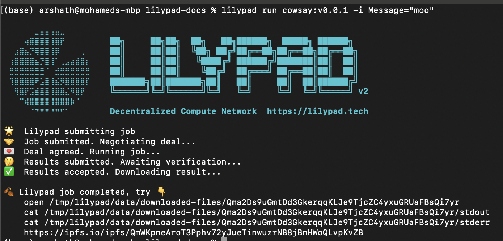
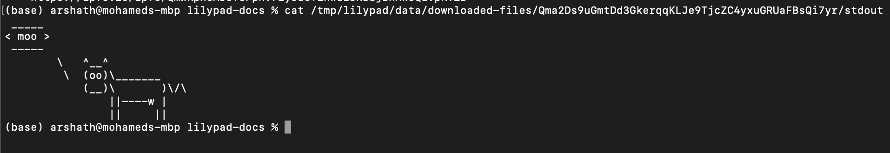

# Run Hello World!


Make sure you have [Lilypad CLI installed](../install-run-requirements.md) and have [set a `WEB3_PRIVATE_KEY` env variable](https://docs.lilypad.tech/lilypad/lilypad-milky-way-testnet/install-run-requirements#id-2.-set-web3\_private\_key) in your environment


### Run Cowsay

1. Run the command below

```bash
lilypad run cowsay:v0.0.3 -i Message="moo"
```

2. Wait for the compute to take place and for the results to be published

<figure><figcaption><p>A successful run</p></figcaption></figure>

3. View your results

```bash
cat /tmp/lilypad/data/downloaded-files/Qma2Ds9uGmtDd3GkerqqKLJe9TjcZC4yxuGRUaFBsQi7yr/stdout
```

<figure><figcaption><p>Looking at your results</p></figcaption></figure>
