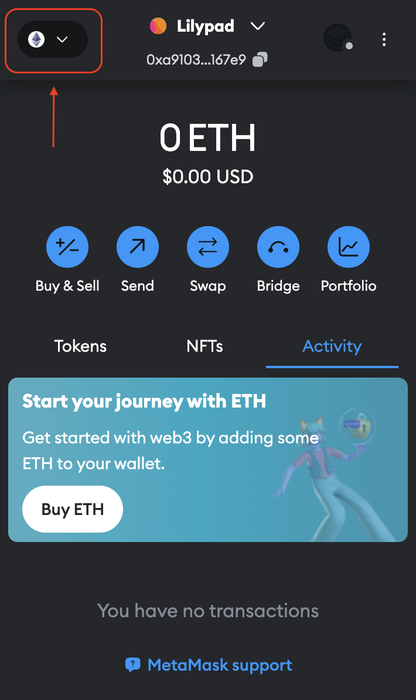
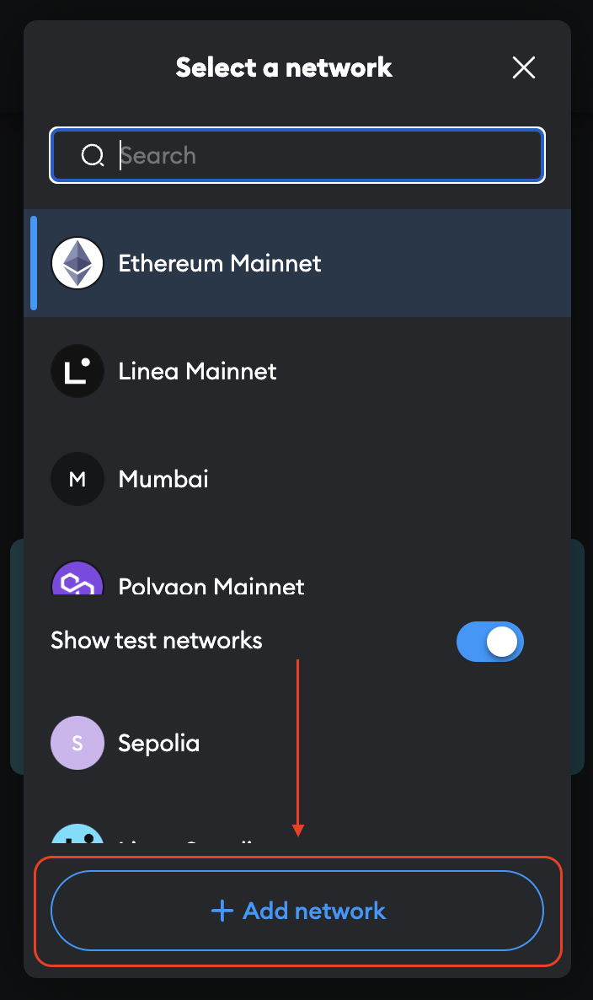
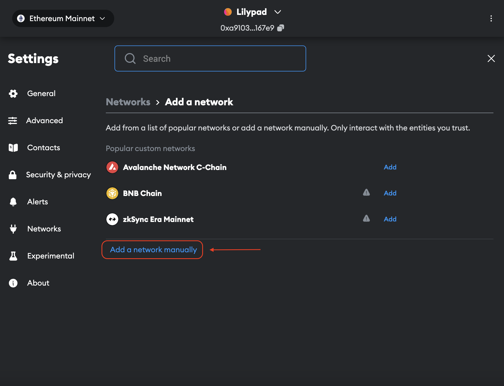
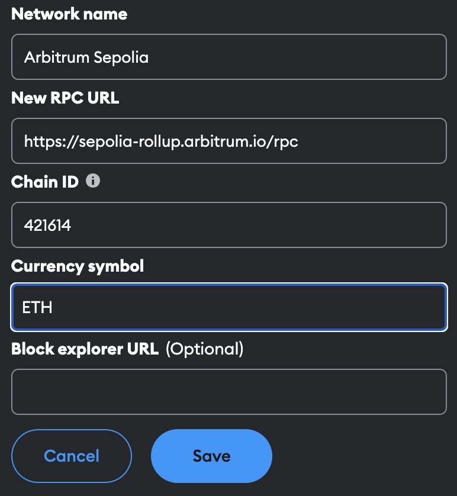

# Setting up MetaMask

## Setting up MetaMask

* Install [MetaMask Extension](https://metamask.io/)
* Next, add the Arbitrum Sepolia Testnet to MetaMask.


Network info above is referenced directly from the Arbitrum Sepolia [documentation](https://docs.arbitrum.io/arbitrum-bridge/quickstart#step-2-add-the-preferred-network-to-your-wallet).


To do this, open MetaMask then click on the network button at the top left of the  the menu bar:

<figure><figcaption></figcaption></figure>

Then click the "Add Network" button:

<figure><figcaption></figcaption></figure>

Next, click on "Add a network manually":

<figure><figcaption></figcaption></figure>

Input all the required Arbitrum Sepolia Testnet network info, and click save:


Network name: Arbitrum Sepolia

New RPC URL: [https://sepolia-rollup.arbitrum.io/rpc](https://sepolia-rollup.arbitrum.io/rpc)

Chain ID: 421614

Currency symbol: ETH

Block explorer URL: (leave blank)\
\
Note: This information is referenced directly from the Arbitrum Sepolia [documentation](https://docs.arbitrum.io/arbitrum-bridge/quickstart#step-2-add-the-preferred-network-to-your-wallet).


<figure><figcaption></figcaption></figure>

Now you're ready to fund the wallet with Testnet tokens!&#x20;
