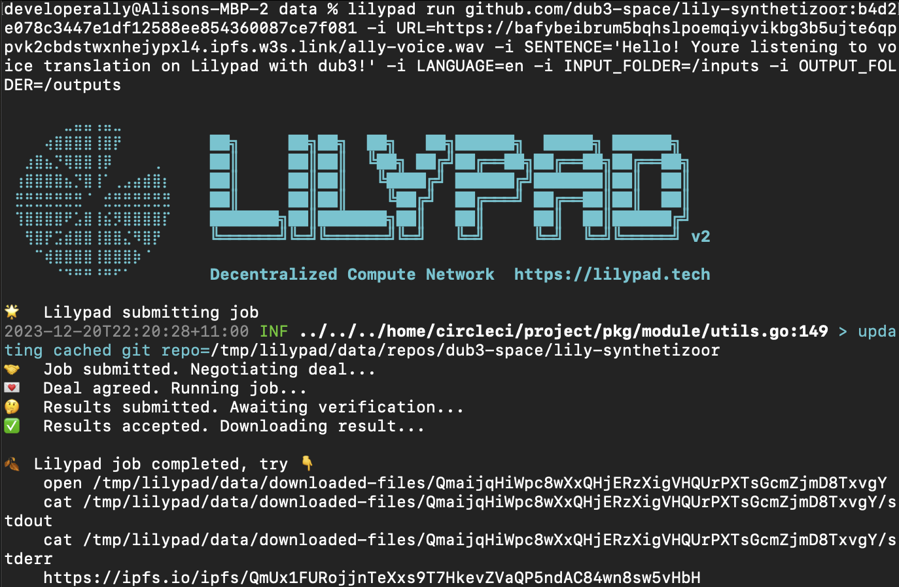

# Run "Hello, World!" Job

## Run Hello, :cow: World! Job

Start Docker

Open a Terminal window and run the following command:

```bash
lilypad run --template cowsay:v0.0.1 --params "hello lilypad"
```

(ensure your user is in the docker group if necessary on your platform)\


Results:

<figure><figcaption></figcaption></figure>

## See the Results

Navigate to the IPFS CID result output in the Results -> [https://ipfs.io/ipfs/QmNjJUyFZpSg7HC9akujZ6KHWvJbCEytre3NRSMHzCA6NR](https://ipfs.io/ipfs/QmNjJUyFZpSg7HC9akujZ6KHWvJbCEytre3NRSMHzCA6NR)


This could take up to a minute to propagate through the IPFS network.


<div data-full-width="true">

<figure><figcaption><p>Output of Lilypad Job</p></figcaption></figure>

</div>

Then click on the stdout folder and you should see the job result!

<div data-full-width="false">

<figure><figcaption><p>This is udderly fantastic!</p></figcaption></figure>

</div>

