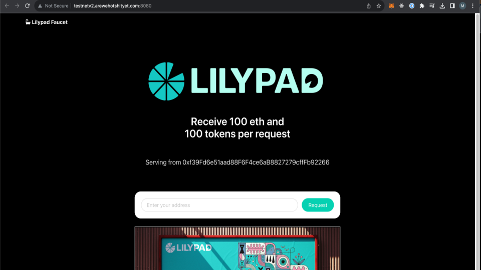

# Funding your Wallet from Faucet

## Funding your wallet

To obtain funds, connect to the lilypad v3 Milky Way testnet network on your wallet and head to the faucet at http://faucet.lilypad.tech:8080 to get ETH and LP


Faucet: [Aurora Testnet](http://faucet.lilypad.tech:8080)


Copy your metamask wallet address into the bar and click request.

<figure><figcaption>
Aurora Testnet Faucet
</figcaption></figure>

Yay we're rich! :moneybag:

<figure><figcaption></figcaption></figure>
