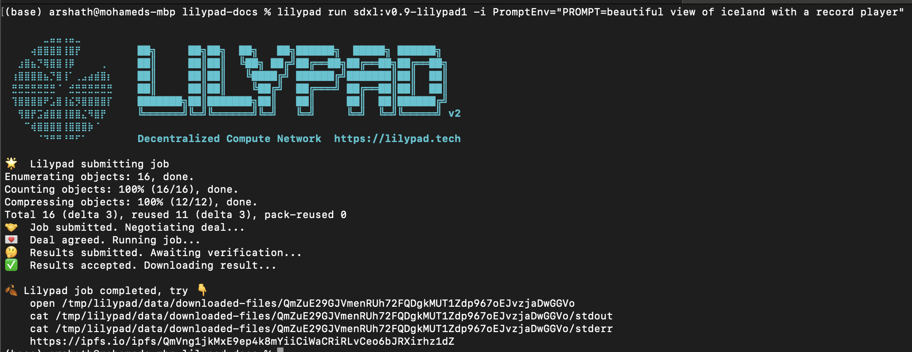
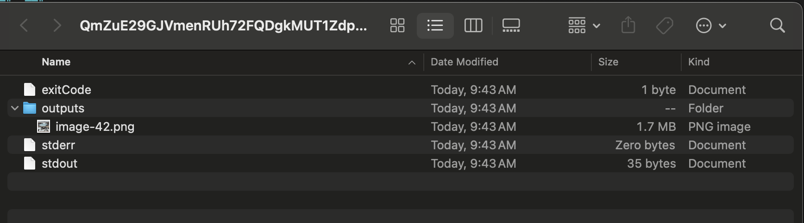

# Stable Diffusion (SDXL0.9)


Hacker Cafe Girl Running SDXL


## Overview

Generically, stable diffusion is what happens when you put a couple of drops of dye into a bucket of water. Given time, the dye randomly disperses and eventually settles into a uniform distribution which colours all the water evenly

In computer science, you define rules for your (dye) particles to follow and the medium this takes place in.

Stable Diffusion is a machine learning model used for text-to-image processing (like Dall-E) and based on a diffusion probabilistic model that uses a transformer to generate images from text.\
\
There are several open-source stable diffusion models out there (made famous by Stability.ai) and they continue to improve and become even more fully featured - SDXL0.9 is one of the more recently open-sourced models.

<figure><figcaption></figcaption></figure>

## \[CLI] Running Stable Diffusion SDXL 0.9


Ensure you have installed all requirements [install-run-requirements.md](../../../../lilypad-milky-way-testnet/quick-start/install-run-requirements.md "mention")


To run stable diffusion use the sdxl module like so:

```
lilypad run sdxl:v0.9-lilypad1 -i PromptEnv="PROMPT=beautiful view of iceland with a record player"
```

The output will look like this:

<figure><figcaption><p>SDXL Output</p></figcaption></figure>

Take the ipfs link given in the results and paste it into your browser:

```bash
https://ipfs.io/ipfs/QmVng1jkMxE9ep4k8mYiiCiWaCRiRLvCeo6bJRXirhz1dZ
```


Please be patient! IPFS can take some time to propagate and doesn't always work immediately.


You could also check the output folder that would have been downloaded at the end of running the job

```bash
open /tmp/lilypad/data/downloaded-files/QmZuE29GJVmenRUh72FQDgkMUT1Zdp967oEJvzjaDwGGVo
```

<figure><figcaption><p>Results of SDXL job on Output Directory</p></figcaption></figure>

In the **/outputs** folder, you'll find the image:

<figure><figcaption><p>The Image in the outputs folder</p></figcaption></figure>

Since modules are deterministic, running this command with the same text prompt will produce the same image, since the same seed is also used (the default seed is 0).


See this [beginner-friendly article](https://aituts.com/stable-diffusion-seed/) on how seed's work for more info on this


To change the image, you can pass in a different seed number:

```bash
lilypad run sdxl:v0.9-lilypad1 -i PromptEnv="PROMPT=beautiful view of iceland with a record player" -i SeedEnv="RANDOM_SEED=24" 
```

<figure><figcaption><p>Output using different seed.</p></figcaption></figure>

#### CLI Video

In this video, Sam demos the use of SDXL in the Lilypad network.


Lilypad \[CLI] Stable Diffusion with SDLX 0.9 Demo


### Looking for Smart Contracts?

\
Try this to start!



