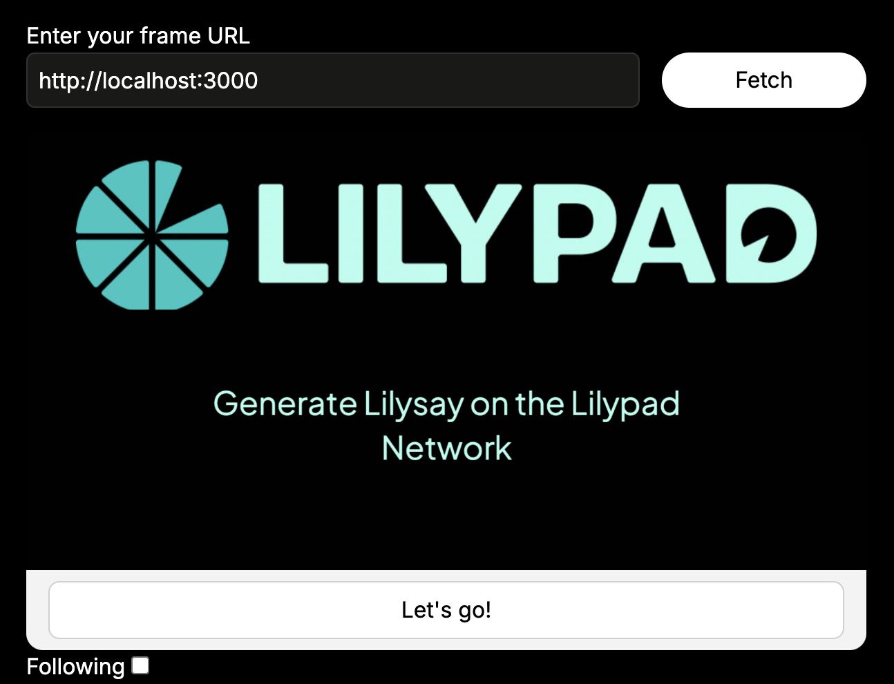

# 🖼️ Farcaster frame

In this guide we will be building a Farcaster frame for local development that runs a Lilysay prompt on the Lilypad Network.

<figure><figcaption></figcaption></figure>

Users of the frame can input a prompt and a generate an image. The generated image will appear in the box above the input and will allow a user to view the ASCII art as an image.


This is an example for running a local version as inspiration for developers. The Lilypad CLI will need to be wrapped and the project hosted as an API to run in production and be used in a [Farcaster Frame](https://docs.farcaster.xyz/developers/frames/).


## Project Setup

### Generate project

For this frame, create a NextJS 14 app:

```bash
npx create-next-app lilypad-farcaster-example
cd lilypad-farcaster-example
```

Next, install the required dependencies. [Coinbase onchain kit](https://github.com/coinbase/onchainkit) is used in this project:

```bash
npm install @coinbase/onchainkit uuid sharp@0.32.6 path fs
```

Open the project in your code editor.

### Get testnet tokens

We will need to fund a wallet with Lilypad and Arbitrum Sepolia testnet tokens. Follow the first 2 sections labelled "Setting up MetaMask" and "Funding your wallet" from our [Quick Start](../../quickstart/cli/) docs.

### Add `.env.local`

Add the following into your `.env.local` file. The private key is used to run the CLI jobs. Make sure that your `.env.local` file is added to the `.gitignore` file as your private key should not be exposed or pushed.


Your `WEB3_PRIVATE_KEY` can be retrieved from the MetaMask account details menu. For more info, check out the [official guide from MetaMask](https://support.metamask.io/managing-my-wallet/secret-recovery-phrase-and-private-keys/how-to-export-an-accounts-private-key/) on how to get a your private key. Please do not push your private key to GitHub.


1. `WEB3_PRIVATE_KEY=YOUR_PRIVATE_KEY`
2. `NEXT_PUBLIC_BASE_URL=http://localhost:3000`

### Install Lilypad CLI

Run through this guide to [install the Lilypad CLI on your machine](../../quickstart/cli/installation.md). Select the CLI User script.

### Run Framegear

Framegear is a simple tool provided by the `@coinbase/onchainkit` package that allows you to run and test your frames locally without publishing the frame.


We will be using Framegear for this build. However, there are other libraries that can be used for this project instead of Framegear.


In a separate terminal, clone down the `onchainkit` repo and run `Framegear`:

```tsx
git clone https://github.com/coinbase/onchainkit.git
cd onchainkit/framegear
npm i
npm run dev
```

Navigate to [`http://localhost:1337`](http://localhost:1337/) and keep that window open for when we start to write the frame.

## Configuration for frame

We will need to set up the metadata for our Next.js application that includes Farcaster frame information. It will configure the elements and a URL for frame posting, while also specifying Open Graph metadata for improved social sharing.

In `app/page.tsx`, add the following before the `Home` function declaration:

```tsx
import { getFrameMetadata } from '@coinbase/onchainkit/frame';
import type { Metadata } from 'next';
const frameMetadata = getFrameMetadata({
  buttons: [
    {
      label: "Let's go!"
    }
  ],
  image: `${process.env.NEXT_PUBLIC_BASE_URL}/initial.gif`,
  post_url: `${process.env.NEXT_PUBLIC_BASE_URL}/api/frame?id=1`,
});

export const metadata: Metadata = {
  title: 'Lilysay Farcaster frame',
  description: 'Initial frame',
  openGraph: {
    title: 'Lilysay Farcaster frame',
    description: 'Initial frame',
    images: ["/initial.png"],
  },
  other: {
    ...frameMetadata,
  },
};
```

## UI Components

The UI elements for this frame are all rendered in the `app/api/route.ts` file, which acts as a request handler for different routes or endpoints within the web application. It defines the logic for handling user input, generating responses, and managing application state. The main functions include processing user prompts, handling status checks, and generating images asynchronously.

### Routes

Here’s how the routes are structured for this frame:

* `/api/frame?action=input`: This route displays the initial user interface, which includes a text input field for the prompt and a button to submit the form. The user interface also updates dynamically based on the processing status, such as showing a placeholder image or the final generated image.
* `/api/frame?action=submit`: This route processes the user input. When a prompt is submitted, the server initiates the image generation process asynchronously. While the image is being generated, the user sees a loading state, and they can check the progress.
* `/api/frame?action=check`: This route checks the status of the image generation process. It updates the frame with either a completed image, an error message if the generation fails, or the processing state if the image is still being generated.
* We also include a fallback just in case an error occurs during the processing of job.
* `/api/frame?action=save`: Though not explicitly included, this could be an additional route for handling the logic of saving the generated image to a location for future access.

### `generateImage`

The `generateImage` function handles the user input and generates the final image for display by utilizing the functions in `app/services/cli.ts`. It ensures that the image is generated asynchronously and the result is available for display in the frame, or handled properly in case of any errors during the generation process.

### Frame images

Throughout the interaction process, various images are used. These images serve as visual cues during each step of the frame, such as when the user is prompted for input, while the image is being processed and once the final result is ready or if an error occurs.

To obtain the images used in this guide, save them from [the source code here](https://github.com/PBillingsby/lilypad-frame-example/tree/main/public).

## Create `route.ts`

Create the `api/frame` directories in your project. Inside of the `app/api/frame` directory, create a file named `route.ts` and add the following code:

```tsx
import { NextRequest, NextResponse } from 'next/server';
import { v4 as uuidv4 } from 'uuid';
import { runCliCommand } from '@/app/services/cli';
import * as fs from 'fs/promises';
import path from 'path';

interface RequestData {
  prompt: string;
  status: 'processing' | 'completed' | 'error';
}

const requestStore: { [key: string]: RequestData } = {};

async function getResponse(req: NextRequest): Promise<NextResponse> {
  const searchParams = req.nextUrl.searchParams;
  const action = searchParams.get("action") || "input";
  const requestId = searchParams.get("id");
  const data = await req.json();
  const prompt = data.untrustedData?.inputText;

  switch (action) {
    case "input":
      return new NextResponse(`<!DOCTYPE html><html><head>
        <title>Input Prompt</title>
        <meta property="fc:frame" content="vNext" />
        <meta property="og:image" content="${process.env.NEXT_PUBLIC_BASE_URL}/enter-prompt.png" />
        <meta property="fc:frame:image" content="${process.env.NEXT_PUBLIC_BASE_URL}/enter-prompt.png" />
        <meta property="fc:frame:button:1" content="Submit" />
        <meta property="fc:frame:input:text" content="Enter your prompt" />
        <meta property="fc:frame:post_url" content="${process.env.NEXT_PUBLIC_BASE_URL}/api/frame?action=submit" />
      </head></html>`);

    case "submit":
      if (prompt) {
        const id = uuidv4();
        requestStore[id] = { prompt, status: 'processing' };

        // Start the image generation process asynchronously
        generateImage(id, prompt);

        // Immediately return the loading state
        return new NextResponse(`<!DOCTYPE html><html><head>
          <title>Request Submitted</title>
          <meta property="fc:frame" content="vNext" />
          <meta property="og:image" content="${process.env.NEXT_PUBLIC_BASE_URL}/loading.gif" />
          <meta property="fc:frame:image" content="${process.env.NEXT_PUBLIC_BASE_URL}/loading.gif" />
          <meta property="fc:frame:button:1" content="Check Status" />
          <meta property="fc:frame:post_url" content="${process.env.NEXT_PUBLIC_BASE_URL}/api/frame?action=check&id=${id}" />
        </head></html>`);
      }
      break;

    case "check":
      if (requestId && requestId in requestStore) {
        const request = requestStore[requestId];
        switch (request.status) {
          case 'completed':
            const imageUrl = `${process.env.NEXT_PUBLIC_BASE_URL}/result.png`;
            return new NextResponse(`<!DOCTYPE html><html><head>
              <title>Result</title>
              <meta property="fc:frame" content="vNext" />
              <meta property="og:image" content="${imageUrl}" />
              <meta property="fc:frame:image" content="${imageUrl}" />
              <meta property="fc:frame:button:1" content="New Request" />
              <meta property="fc:frame:post_url" content="${process.env.NEXT_PUBLIC_BASE_URL}/api/frame?action=input" />
            </head></html>`);
          case 'error':
            return new NextResponse(`<!DOCTYPE html><html><head>
              <title>Error</title>
              <meta property="fc:frame" content="vNext" />
              <meta property="og:image" content="${process.env.NEXT_PUBLIC_BASE_URL}/error.png" />
              <meta property="fc:frame:image" content="${process.env.NEXT_PUBLIC_BASE_URL}/error.png" />
              <meta property="fc:frame:button:1" content="Try Again" />
              <meta property="fc:frame:post_url" content="${process.env.NEXT_PUBLIC_BASE_URL}/api/frame?action=input" />
            </head></html>`);
          case 'processing':
            return new NextResponse(`<!DOCTYPE html><html><head>
              <title>Processing</title>
              <meta property="fc:frame" content="vNext" />
              <meta property="og:image" content="${process.env.NEXT_PUBLIC_BASE_URL}/loading.gif" />
              <meta property="fc:frame:image" content="${process.env.NEXT_PUBLIC_BASE_URL}/loading.gif" />
              <meta property="fc:frame:button:1" content="Check Again" />
              <meta property="fc:frame:post_url" content="${process.env.NEXT_PUBLIC_BASE_URL}/api/frame?action=check&id=${requestId}" />
            </head></html>`);
        }
      }
      break;
  }

  // Fallback response
  return new NextResponse(`<!DOCTYPE html><html><head>
    <title>Error</title>
    <meta property="fc:frame" content="vNext" />
    <meta property="og:image" content="${process.env.NEXT_PUBLIC_BASE_URL}/error.png" />
    <meta property="fc:frame:image" content="${process.env.NEXT_PUBLIC_BASE_URL}/error.png" />
    <meta property="fc:frame:button:1" content="Start Over" />
    <meta property="fc:frame:post_url" content="${process.env.NEXT_PUBLIC_BASE_URL}/api/frame?action=input" />
  </head></html>`);
}

// Runs the CLI command and saves the result as an image
async function generateImage(id: string, prompt: string) {
  try {
    const imageBuffer: any = await runCliCommand(prompt);
    const imagePath = path.join(process.cwd(), 'public', 'result.png');
    await fs.writeFile(imagePath, imageBuffer);
    requestStore[id] = { prompt, status: 'completed' };
  } catch (error) {
    console.error('Error generating image:', error);
    requestStore[id] = { prompt, status: 'error' };
  }
}

export async function POST(req: NextRequest): Promise<Response> {
  return getResponse(req);
}

export const dynamic = 'force-dynamic';
```

## Create `cli.ts`

This is where the execution of the Lilysay job happens. It will run the job, wait for it to finish and then create an image from the return value.

Inside of the `app` directory, create a new directory named `services` and inside of that create a file named `cli.ts`. The functions inside this file will allow us to send a prompt to the Lilypad Network using the user prompt and a predefined command that runs asynchronously in the terminal. Once the command is executed, Lilypad processes the input through its Lilysay module and outputs the results in the form of an ASCII image, which is then converted into a displayable image using an SVG-to-PNG transformation.

Here are the 3 functions inside this file:

* **`createImageBufferFromAscii`**: Converts ASCII text into an SVG image and then uses the `sharp` library to convert the SVG into a PNG image buffer. This allows the display or saving of an image representation of the ASCII text.
* **`runCliCommand`**: Executes a Lilypad CLI command to process the user's input text, captures the command's output, and converts it into an image buffer. It handles the entire process of running the command, capturing the output, and managing errors.
* **`extractStdoutFilePath`**: Parses the CLI command's stdout to extract the file path where the Lilypad CLI has saved the output. It uses a regex pattern to identify the path in the command's output.

The following code snippet demonstrates the process:

```typescript
import { spawn } from 'child_process';
import { promises as fs } from 'fs';
import * as path from 'path';
import { fileURLToPath } from 'url';
import sharp from 'sharp';

const __filename = fileURLToPath(import.meta.url);
const __dirname = path.dirname(__filename);

const MODULE_VERSION = "cowsay:v0.0.4";

// Function to generate an image buffer from ASCII text
async function createImageBufferFromAscii(asciiText, aspectRatio = 1.91) {
  const fontSize = 14;
  const lineHeight = fontSize + 6;
  const padding = 20;

  const lines = asciiText.split('\\n');

  const textHeight = lines.length * lineHeight + padding * 2;

  let width, height;
  if (aspectRatio === 1.91) {
    width = Math.max(textHeight * aspectRatio, 800);
    height = textHeight;
  } else if (aspectRatio === 1) {
    width = height = Math.max(textHeight, 800);
  }

  const escapeXML = (unsafe) => {
    return unsafe.replace(/&/g, "&amp;")
      .replace(/</g, "&lt;")
      .replace(/>/g, "&gt;")
      .replace(/"/g, "&quot;")
      .replace(/'/g, "&#039;");
  };

  const escapedLines = lines.map(line => escapeXML(line));

  const textWidth = Math.max(...escapedLines.map(line => line.length)) * fontSize * 0.6;
  const xPosition = Math.max((width - textWidth) / 2, 10);

  // Generate SVG markup with the ASCII content
  const svgImage = `
    <svg width="${width}" height="${height}" xmlns="<http://www.w3.org/2000/svg>">
      <rect width="100%" height="100%" fill="white" />
      <style>
        .text-content { font-family: monospace; font-size: ${fontSize}px; fill: black; white-space: pre; }
      </style>
      <text x="${xPosition}" y="${padding}" class="text-content">
        ${escapedLines.map((line, index) => `<tspan x="${xPosition}" dy="${index === 0 ? '0' : lineHeight}">${line}</tspan>`).join('')}
      </text>
    </svg>
  `;

  // Convert the SVG to a PNG image buffer using sharp
  return sharp(Buffer.from(svgImage)).png().toBuffer();
}

// Function to run the Lilypad CLI command
export async function runCliCommand(inputs) {
  console.log("Lilypad Starting...");

  const web3PrivateKey = process.env.WEB3_PRIVATE_KEY;
  if (!web3PrivateKey) {
    throw new Error('WEB3_PRIVATE_KEY is not set in the environment variables.');
  }

  // Construct the command to run Lilypad with the user input
  const command = `lilypad run ${MODULE_VERSION} -i Message="${inputs}"`;
  console.log("Command to be executed:", command);

  // Execute the command as a shell process
  return new Promise((resolve, reject) => {
    const child = spawn('bash', ['-c', `export WEB3_PRIVATE_KEY=${web3PrivateKey} && ${command}`]);

    let stdoutData = '';
    let stderrData = '';

    // Capture stdout from the CLI command
    child.stdout.on('data', (data) => {
      stdoutData += data.toString();
      console.log(`Stdout: ${data}`);
    });

    child.stderr.on('data', (data) => {
      stderrData += data.toString();
      console.error(`Stderr: ${data}`);
    });

    child.on('close', async (code) => {
      if (code !== 0) {
        reject(new Error(`Process exited with code ${code}`));
        return;
      }

      if (stderrData) {
        reject(new Error(stderrData));
        return;
      }

      console.log("Process completed successfully!");

      try {
        // Extracts the file path, reads the ASCII content and converts it to an image buffer
        const stdoutFilePath = extractStdoutFilePath(stdoutData);
        const asciiContent = await fs.readFile(stdoutFilePath, 'utf-8');
        const imageBuffer = await createImageBufferFromAscii(asciiContent);
        resolve(imageBuffer);
      } catch (error) {
        reject(new Error(`Error processing output: ${error.message}`));
      }
    });

    child.on('error', (error) => {
      reject(new Error(`Error with spawning process: ${error.message}`));
    });
  });
}

// Helper function to extract the stdout file path from the CLI output
function extractStdoutFilePath(stdoutData) {
  const match = stdoutData.match(/cat (\/tmp\/lilypad\/data\/downloaded-files\/\w+\/stdout)/);
  if (!match || !match[1]) {
    throw new Error('Stdout file path not found in CLI output');
  }
  return match[1];
}
```

* **Sending the Request**: The user's input text is passed directly into the **Lilypad CLI command** using a shell process. The input text is embedded within the command's arguments and executed asynchronously in the terminal.
* **Handling the Response**: After the CLI command completes, the output is captured and processed. The response includes the file path to the generated ASCII image, which is then read from the file system and converted into a PNG image for further use.
* **Error Handling**: If an error occurs during the execution of the CLI command or file processing, it is logged to the console, and the process is terminated with appropriate error messaging.

## Testing

The Framegear server is running. Next, run your local server in your frame project. We will need to make sure it is running on port 3000:

```bash
npm run dev
```

Navigate to the Framegear host [http://localhost:1337](http://localhost:1337/) and you will see an input labeled "Enter your frame URL". Add http://localhost:3000 to that and click "Fetch".

<figure><figcaption></figcaption></figure>

You should now see your frame and be able to interact with it. Enter a prompt to display in the Lilysay ACSII image!&#x20;

## Rendering results

As the job is processed, a “Check Status” button will be displayed. Clicking this will check if the job has been completed. Once a job is completed, the results will be displayed in the frame. If there is an issue along the way, an error message will be displayed and the user will be prompted to try again.

## Potential Use Cases

Running Lilysay jobs is just one of the ways you can utilize Lilypad in a frame, but you can run jobs with any available modules on the Lilypad Network. Some of these include:

* Stable Diffusion image
* Stable Diffusion video
* Ollama

## Resources

* [Source code](https://github.com/PBillingsby/lilypad-frame-example)
* [Farcaster frames documentation](https://docs.farcaster.xyz/developers/frames/)
