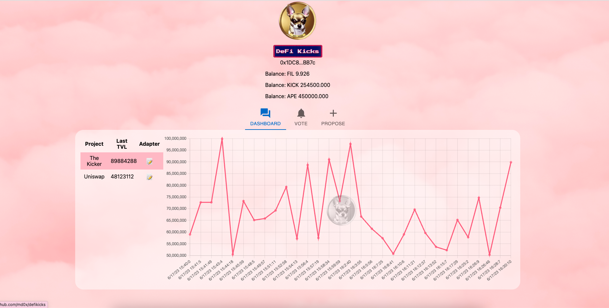
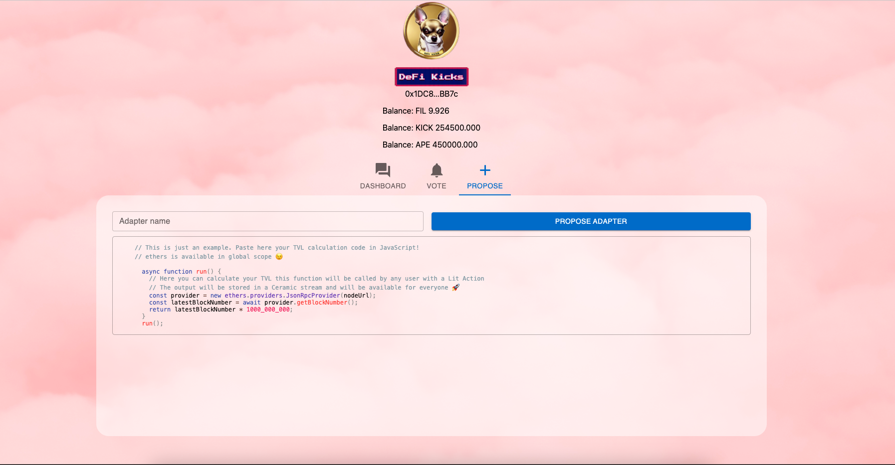

# 👟 DefiKicks (HackFS Winner 2023)


DefI Kicks Video



See the Lilypad Example at [drand-off-chain-voting.md](../lilypad-v0-examples-deprecated/drand-off-chain-voting.md "mention")


## Overview

DefiKicks is a decentralized, community-governed Data DAO (Decentralized Autonomous Organization) that operates on the Filecoin network, with the goal of democratizing DeFi data aggregation and TVL (Total Value Locked) calculations. It seeks to improve transparency and foster collaboration through a system of on-chain adapter proposals, off-chain voting, and interoperable token rewards.

 

At its core, DefiKicks is a counter to the centralization issues prevalent in traditional DeFi data aggregators such as DefiLlama. By shifting the TVL calculations to be performed on-chain, DefiKicks ensures data authenticity and transparency. In essence, it functions similarly to a version control system like 'Git,' allowing anyone to propose a new TVL adapter for a project.

Adapter proposals are initiated on-chain via an IPFS hash, with the adapter code hosted on IPFS. Voting is conducted off-chain using the time-lock encryption of Drand, with results brought back on-chain through Bacalhau Lilypad, a trusted oracle. Upon community approval, adapters are registered on-chain in the 'Registry' contract, which maintains a transparent and immutable record of approved adapters.

Active participants in the voting process who align with the majority are rewarded with KICK tokens. The issuance of these tokens is governed by a smart contract, incentivizing participation and wise decision-making.

Following adapter registration, the decentralized backend begins calculating data points using the code hosted on IPFS. This process employs Lit's Programmable Key Pairs and Lit Actions, with all TVL results hosted on a Ceramic Stream. The results are then viewable by users on the frontend, further promoting an open and transparent DeFi ecosystem.

DefiKicks uses a suite of modern technologies to power its platform, including smart contracts for governance, the LIT protocol for decentralized data governance calculation, Ceramic for decentralized data storage, libp2p for secure peer-to-peer network connections, ApeCoin for alternative voting options, Bacalhau for off-chain jobs execution, Filecoin FEVM for contract interactions, IPFS for decentralized data storage, Web3.Storage for reliable data transfer, and Drand for unbiased off-chain voting.

In essence, DefiKicks, with its combination of technologies, proposes a novel, transparent, and decentralized approach to DeFi data. It is a testament to the possibilities of decentralized governance and data analytics, aiming to usher in a new era of trust and accessibility in DeFi analytics.

## Architecture

 (1) (1) (1) (1) (1) (1) (1) (1) (1) (1).png>)

DefiKicks operates on a foundation of decentralized technologies and protocols to ensure transparent, accessible DeFi data.

It uses smart contracts on Filecoin's FEVM for governance, including adapter proposal, voting, and registration.

The LIT protocol allows for secure, decentralized data calculations, while Ceramic facilitates decentralized data storage.

Lilypad + Bacalhau carries out off-chain jobs such as reward computation and vote tallying.

PFS and Web3.Storage ensure secure and efficient data storage and transfer, while Drand provides unbiased off-chain voting through time-lock encryption.

## Find out more about DefiKicks.xyz

<table data-view="cards"><thead><tr><th></th><th data-hidden></th><th data-hidden data-card-target data-type="content-ref"></th><th data-hidden data-card-cover data-type="files"></th></tr></thead><tbody><tr><td>DefiKicks Live Site</td><td><a href="https://defikicks.xyz/">https://defikicks.xyz/</a></td><td><a href="https://defikicks.on.fleek.co/">https://defikicks.on.fleek.co/</a></td><td><a href="../.gitbook/assets/Screenshot 2023-06-27 at 7.58.56 pm (1).png">Screenshot 2023-06-27 at 7.58.56 pm (1).png</a></td></tr><tr><td>DefiKicks Github</td><td></td><td><a href="https://github.com/md0x/defikicks">https://github.com/md0x/defikicks</a></td><td><a href="../.gitbook/assets/github.png">github.png</a></td></tr><tr><td>HackFS Submission</td><td></td><td><a href="https://ethglobal.com/showcase/defikicks-b1wo0">https://ethglobal.com/showcase/defikicks-b1wo0</a></td><td><a href="../.gitbook/assets/FwMoaTuWIAch8j1.png">FwMoaTuWIAch8j1.png</a></td></tr></tbody></table>
