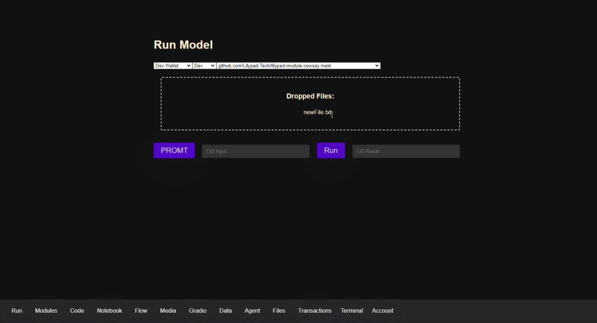
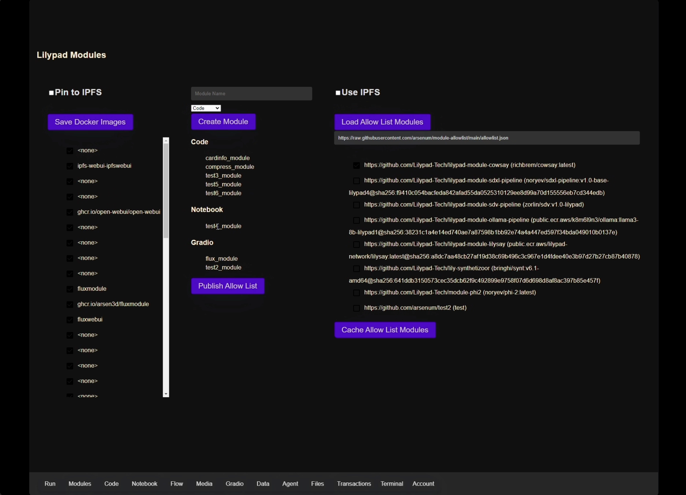
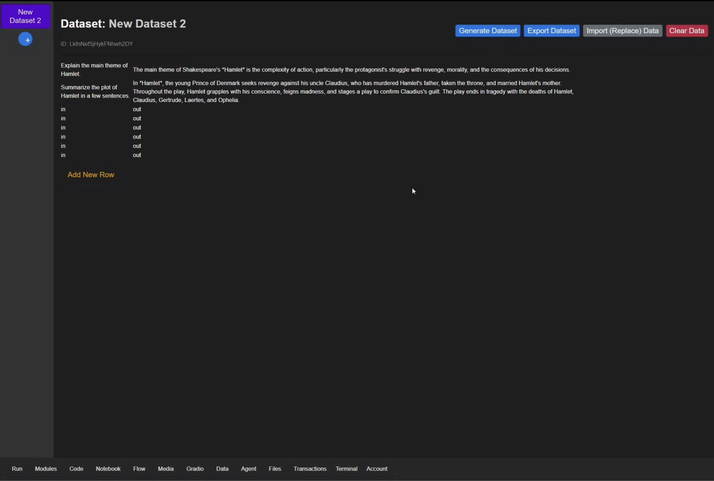
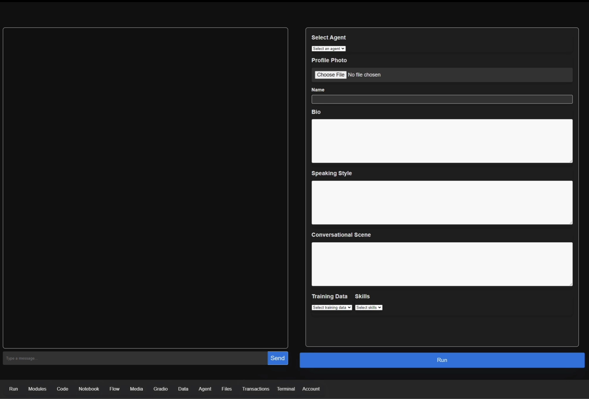

# 🛠️ Lilypad ML Workbench

The [Lilypad ML workbench](https://github.com/arsen3d/LilypadWorkbench) provides ML researchers, businesses, and more a simple interface for leveraging the Lilypad network.

The ML workbench provides an interface to:

* Run models that are currently available on the Lilypad GPU network
* Add a new model to run on the network as a [Lilypad module](https://docs.lilypad.tech/lilypad/developer-resources/build-a-job-module)
* Leverage Jupyter notebooks with Lilypad
* Create multi-module flows
* Fine tune models
* Create an AI agent

In order to run an AI model on the Lilypad network, a docker image must be created for the program using the [Lilypad module spec](https://docs.lilypad.tech/lilypad/developer-resources/build-a-job-module).


The ML workbench product is currently in beta testing and is not yet provided as a hosted solution. Reach out in the Lilypad [Discord](https://discord.gg/zSErHwZSyC) for more info!


## AI Inference

<figure><figcaption></figcaption></figure>

Run existing Lilypad modules with a simple text or image prompt. The workbench will output an IPFS CID with the result.

Implement the Lilypad module allowlist and cache the models locally before they are needed! Pin the files to a local IPFS node packaged with the workbench platform.

<figure><figcaption></figcaption></figure>

## Finetuning

Import a dataset and use the the "Data" tool to finetune a model for a specific end user. Create a Lilypad module and save the module on IPFS. More on this soon!

<figure><figcaption></figcaption></figure>

## Create an AI agent and run on Lilypad

The ML workbench provides a simple interface for creating and training AI agents. The Lilypad team is currently testing a variety of models and fine tuning techniques to determine the optimal path forward for this feature. More on this soon!

<figure><figcaption></figcaption></figure>

### Resources

* [Source code](https://github.com/arsen3d/LilypadWorkbench)

