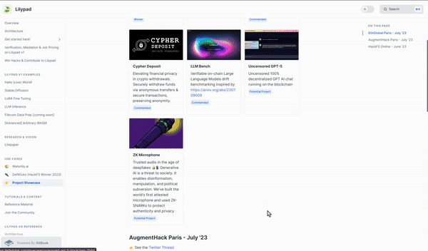

# 🙌 Win Hacks & Contribute

## Hackathon & Project Ideas for Lilypad (Milky Way)

Here are some ideas for what you could build with Lilypad Milky Way!


💚 Good first project (Lilypadawan)

💛 Moderate skill needed

❤️ Jedi mode!&#x20;


### 🤝 Crossover POCs, Integrations & Plugins!


Earn those double bounty dollars building out crossover POCs to Lilypad!


Lilypad is aiming to build out a full suite of decentralized AI projects, which means we want to collaborate with other projects in the ecosystem to make this vision a reality.&#x20;

These include linking Lilypad compute with storage providers, data streams, databases & more.

This also means adding layers like privacy or extending usage into other frameworks like Unity or React Native projects.\
\
Some examples include:

* Using Filecoin aggregators like Banyan or Tableland Basin with Lilypad
* Extending the Chainsafe Unity SDK to add Lilypad jobs as an option
* Building Lilypad into Mona or creating a module to use on Mona
* Integrating with The Graph
* Doing a POC with data from someone like WeatherXM
* Adding privacy layers for data with Lit Protocol
* ZK Computations using zkSync for verifiable credentials and identity proofs without revealing sensitive information
* A decentralized oracle service that uses AI to fetch, verify, and deliver real-world data from tools like Chainlink to smart contracts

There are also opportunities to extend the functionality of Lilypad compute with items like:

* CICD pipelines
* Vector databases
* Autonomous agents
* Batching jobs with an external script
* Chaining jobs together in a pipeline\

### 💅 Contribute a Module

Contributing a module is one of the coolest things to do for Lilypad. There are so many many options for compute and AI jobs that you can run with Lilypad, including adding new state-of-the-art OSS AI models&#x20;

* Text to speech
* Text to opera (have you heard this one!)
* Finetuning models for SDXL and LLM
* Image -> cartoon (or anything else)
* Build a module that classifies images into predefined categories (e.g., cats, dogs)
* A basic recommendation system for movies, books, or products based on user preferences
* Personal finance tracker that uses AI to categorize and analyze spending patterns.
* A module that provides personalized tutoring and learning assistance using AI\

As a quick refresher, the current Module Making Pipeline ([see full "Build a job module" resource](developer-resources/build-a-job-module.md)) looks like this:

1. Find or build a compute script (for example, [a Python script on Hugging Face like SDXL](https://huggingface.co/docs/diffusers/en/using-diffusers/sdxl))
2. **NOTE**: You must [make sure your compute job is deterministic](https://docs.lilypad.tech/lilypad/lilypad-milky-way-reference/build-a-job-module#ensuring-determinism) (this is possible with AI scripts also! [See this reference](https://huggingface.co/docs/diffusers/v0.27.2/en/using-diffusers/reusing\_seeds#reproducible-pipelines))
3. Containerise the script with Docker ([see this blog for more info](https://blog.lilypadnetwork.org/how-to-build-a-custom-job-module-on-lilypad#heading-containerising-and-configuration))
4. Add a Lilypad Spec - this is simply a GitHub repo - [you can grab a template here](https://github.com/Lilypad-Tech/lilypad-module-boilerplate)!


Share your module with us by submitting a pull request to the [GitHub here](https://github.com/Lilypad-Tech/awesome-Lilypad?tab=readme-ov-file#modules)!


### ✨ DX Enhancements

Lilypad is still evolving and is currently mostly in Beta phase. This means there are A LOT of opportunities to help build out better DX for your fellow dev's.

One of the main opportunities is in the module making pipeline. See [#contribute-a-module](win-hacks-and-contribute.md#contribute-a-module "mention") for a quick breakdown of the developer journey).\
\
Some of the opportunities to improve this process include:

* 💛 An application that can auto-containerise (or auto-dockerise) a given compute script
  * ❤️ BONUS IDEA: You could even then make a module to run the auto-containerising script on Lilypad after it's built! 🧙
* 💚 You could go one further and also have it auto-generate the Lilypad spec as well!
* ❤️ A determinism checker that could help determine if there are any obvious parts of the script (like timestamps) that would make it non-deterministic and show an error for this.
* 💛💛 Ways to make it easy for folks without GPUs at home to build & test a module
* 💚 Implement developer tooling for debugging and monitoring compute jobs, providing real-time feedback and logs
* 💛 Tools that analyze and optimize the performance of compute scripts, suggesting improvements and best practices
* 💚 Implement static analysis tools to check for code quality, style, and potential issues in compute scripts
* ❤️ Create tools to automatically audit compute scripts and modules for security vulnerabilities and compliance with best practices

### 👾 End User Projects

Build out other end-user projects across a broad range of verticals. We are very interested to hear the type of projects people are looking to build on the Lilypad Network and have released a Javascript wrapper to help folks build easily.

Here are a few basic ideas of end user projects:

* **Education:** AI-powered educational tools for personalized learning experiences
* **Music:** Developing AI-driven music composition tools, or applications for real-time music analysis and recommendation
* **Finance:** Leverage AI for risk assessment and trading strategies
* **Retail:** Building recommendation engines using AI for e-commerce platforms
* **Environment:** Developing solutions for environmental monitoring and pollution tracking
* **Security: T**ools using AI for auditing and security analysis

\
\
Projects across DeFi, DeSci, Gaming, & Metaverse, NFTs, IOT and more, as well [#crossover-pocs-integrations-and-plugins](win-hacks-and-contribute.md#crossover-pocs-integrations-and-plugins "mention")!\

### 🐐 Need more inspiration?

See the [project-showcase.md](use-cases/project-showcase.md "mention") page!


Pssst... We'd love to share your projects here too! Feel free to [submit a PR](https://github.com/Lilypad-Tech/lilypad-docs)!


<figure><figcaption></figcaption></figure>

### ✨We would love to hear your feedback!✨

We hope this project page inspires you to build amazing things with us! If you have any ideas, suggestions, or any questions, we'd love to hear from you! Join our community on Discord to share your thoughts, ideas, ask questions, and get the support you need from the Lilypad team. 🪷

[Join our Discord channel here](https://lilypad.team/discord)!

### **🌱Your feedback helps us improve and grow together!** 
